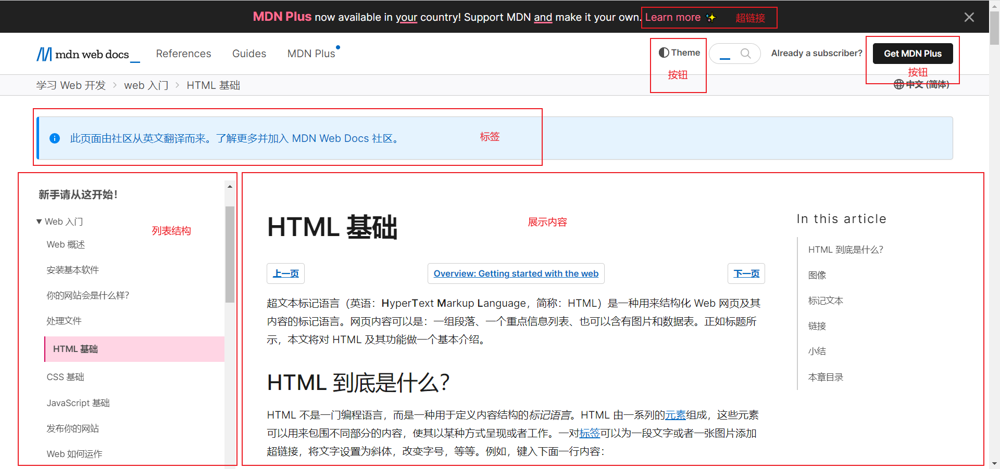

# 前端是什么呢？？
我认为的前端就是将页面、数据等展示给用户，负责与用户进行交互的部分，也就是我们所有的UI。
但在不同的环境中UI也就有了区别。比如我们现在所说的网页，它就是一种极为直观的数据展现形式。

# 聊聊网页
## 网页是什么
网页都不陌生，作为程序员我们应当认识到：网页的本质就是代码。
网页是由一行一行的代码组成的，将这些代码展现出来的媒介就是——浏览器。
## 网页代码的组成
网页中的代码可以分为三部分：HTML、CSS以及JavaScript。这三部分分别负责网页的不同结构。
HTML刻骨，CSS画形，JS(JavaScript)赋灵。每一部分又可视为一门语言。
- **只有JS才是编程语言，将HTML、CSS称为编程语言是不对的**
## 浏览器
浏览器是网页显示、运行的平台。之所以浏览器可以显示网页是因为浏览器中有着**专门对代码进行解析渲染的部分(渲染引擎，浏览器的内核)**
渲染引擎的不同，导致浏览器解析相同的代码时速度、性能、效果也不相同。
Google浏览器的内核是Blink(基于Webkit的分支)

# HTML、CSS、JS
因为网页的发展历史，编写网页要涉及到 HTML、CSS、JS 三门语言。
我们没必要了解网页究竟是如何发展的，但是我们必须要知道现行的Web标准要求页面实现：结构、表现、行为三层分离。
我们先看一个网页。

通过标注，我们可以看到这个网页有列表、按钮、标签等部分组成。这些组成部分就是我们说的结构。
按钮有着不同的表现样式，这个样式我们称为按钮的表现形式。
当我们点击 Theme 按钮时，页面会进行弹窗响应。这个弹窗的动作就是页面的行为。
又结构、表现、行为分别对应着HTML、CSS、JS，所以我们常说网页由HTML、CSS、JS三部分组成。
## (结构)HTML
结构就是我们说的网页的页面元素，对应的术语就是HTML。
HTML，超文本标记语言(Hyper Text Markup Language)，用于对文本、图片、音视频等内容的描述展示。
HTML展现网页结构的手段：标签。
我们可以通过如下代码段认识HTML标签：
```html
<html>
    <head></head>
    <body>
        
        <video>
    </body>
</html>
```
### 认识标签
1. 标签是由一对`< >`括起来的，由字母或英文单词组成的语义体。
2. 标签可以两个成对出现，也可以是一个独立出现
3. 每个标签都有其自己的含义，如图片、视频、表格、网页头、网页尾，一个网页上所有的标签各司其职共同组成网页的整体结构。
4. 绝大多数标签支持嵌套
5. 因为标签的嵌套，标签之间可以分为父子关系和兄弟关系(包含/并列关系)。
6. 可以为标签设置属性，增强标签的使用效果。`比如`

## (表现)CSS
表现指的是网页的页面样式。
CSS，层叠样式表(Cascading Style Sheets)。用于网页的展现形式。比如你想将字体展现为红色、蓝色或者绿色。
将表格居中、放在最左边或者放在最右边。

## (行为)JS
网页的行为是页面与用户的交互。

# HTML与网页的关系
HTML是语言，网页就是呈现出来的网页。网页的本质是代码也就是HTML+CSS+JS等内容，其中HTML只是构成网页的骨架。
HTML之所以被称为网页的骨架是因为 '标记' 一词。通过不同的标记，HTML通过描绘出不同的结构。
类比于人身体的不同结构，HTML很直观的对网页中不同固件进行了描述。
所以HTML刻骨，CSS刻形。尽管HTML中也有形体但最好是对骨和形进行分离。
