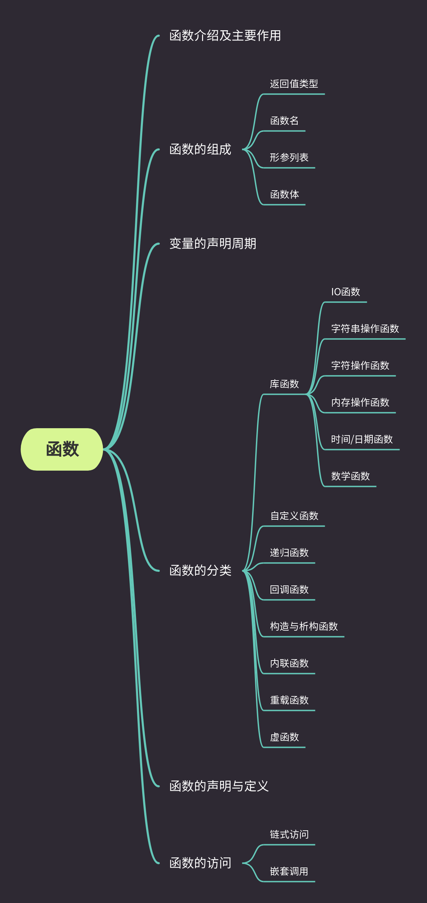

函数是计算机程序中非常重要的一个概念。也是组成程序的最小单元。
函数由 返回值、函数名、形参 以及 函数体，四大部分组成。
函数的主要作用是实现了对过程的封装和对细节的隐藏。
按照函数来源函数可以分为：库函数、自定义函数。
常见的库函数又可以分为：IO函数、字符串操作函数、字符操作函数、内存操作函数、时间/日期操作函数、数学函数、
进程函数、数据库函数等等。
常见的函数类型有：库函数、自定义函数、回调函数、构造与析构函数、内联函数、虚函数、递归函数

         

## 生命周期

函数涉及到一个非常重要的知识点：值传递与地址传递。
[源代码--值传递和地址传递](../assets/Source/BaseCPP/chuandi.c)          
由此引出函数内部改变变量值的方法：传址、静态成员

形参当函数调用完成之后就自动销毁了，因此形参只在函数内有效。

## 函数的嵌套调用和链式访问
函数之间是平等的因此函数中不能再定义函数。但是函数中可以调用函数(包括该函数自己)。
链式访问：将一个函数的返回值作为另外一个函数的参数。
`printf("%d", printf("%d", printf("%d", 43)));  //打印结果4321`

## 函数的声明与定义
- 函数的声明，告知编译器有这么一个函数。并向编译器阐述了函数叫什么，参数是什么以及返回值类型是什么。
但是该函数是不是真的存在，无关紧要。
函数的声明要放在函数的使用之前(先声明后使用)
函数声明一般放在头文件中。(头文件的声明，其实就是替换头文件中的内容)
- 函数的定义，这个函数做了什么事
声明只是说有这个定义，而函数的定义则决定了函数的存在。(定义包含了一种强有力的声明)

## 递归函数
#### 什么是递归
程序调用自身编的程技巧称为递归。
一个过程或函数在其定义或说明中直接或间接调用自身的一种方法，它通常把一个大型复杂的问题层层转化为一个与原问题相似的规模较小的问题来求解。
递归策略只需要少量的程序代码就可以描述出解题过程所需要的多次重复计算，大大减少了程序的代码量。
**递归的主要思想在于：大事化小**
递归的两个必要条件：
- 存在限制条件，当满足这个限制条件的时候，递归便不再继续
- 每次递归调用后越来越接近这个限制条件

#### 递归的注意事项
1. 不能写死递归，都有跳出条件，每次递归逼近跳出条件
2. 递归层次不能太深
因为递归极容易导致栈溢出，因此一定要认真对待递归的注意事项。       

[源代码---递归举例](../assets/Source/BaseCPP/digui.c)          