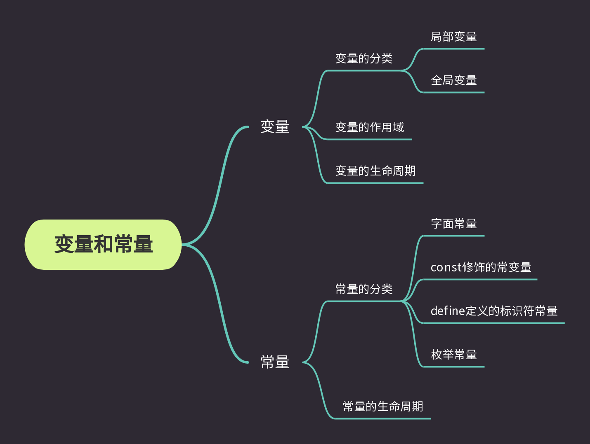

变量和常量

变量的分类：局部变量，全局变量
当局部变量和全局变量名字冲突时，局部优先

变量的作用域和变量的生命周期。
变量在哪里可以使用那里就是它的作用域
局部变量的作用域，就是局部变量的作用域
全局变量的作用域，是整个工程

变量的生命周期：变量的创建和销毁之间的时间段。
局部变量的生命周期：进入局部范围生命开始，出局部范围生命结束
全局变量生命周期：程序的生命周期

常量：
1. 字面常量
2. const修饰的常变量
3. define定义的标识符常量
4. 枚举常量(可以一一列举的常量)，是有值的，默认从0开始计数