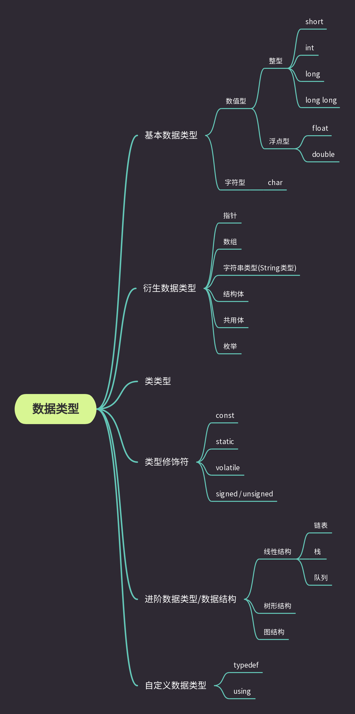

数据类型可以分为基本数据类型和衍生数据类型
基本数据类型，如int、double、char
衍生数据类型，如：数组、指针、类类型等
衍生类型是基本类型的进阶用法，没那么可怕，也没那么复杂

                   

## 整型
- short(int)、int、long(int) 和 long long(int)，除int外其它类型的int均可省略。
- 区别在于所占字节的不同 (sizeof(long long)=8) >= (sizeof(long)=8或者4) >= (sizeof(int)=8或者4、2) >= (sizeof(short)=4或者2)
- 不难看出不同数据类型所占的字节数也不相同。这是因为C语言标准只规定了short和long最小的应该占用的字节数sizeof(short)=2、sizeof(long)=4，这就导致了不同的厂商开发出来的编译器存在了很大的差异。通常使用字节数时按照，short所占的字节数为 2，int所占字节数为 4，long所占字节数为 4，long long所占字节数为 8 进行计算。
- sizeof是 **一个操作符(运算符)**，可用于计算操作对象所占有的字节数。     

## 浮点型
- float、double
- 区别也在于所占字节数的不同。sizeof(float)=4, sizeof(double)=8

## 数值型的字节分布

## 数值型字节分布不同带来的影响

## 字符型
- char
- 一切可见皆为字符。很显然这句话与数值型相冲突。Good有冲突我们解决冲突。

## 指针

## 数组

## 字符串

## 结构体

## 共用体

## 枚举

## 自定义类型