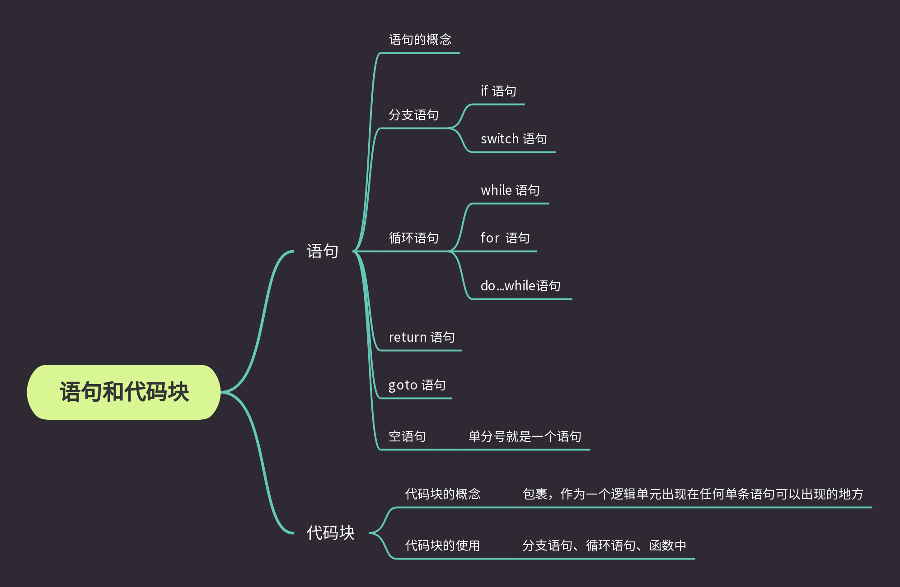

语句和代码块是C/C++中非常基础的一个概念。
所谓之语句实际上就是 C/C++ 中的一句话，不同于现实生活中的句号(。) C/C++中使用英文的分号(;)来表示一句话的结束。使用英文的大括号来表示一段话，即代码块。
         

# 语句
C语言中一个分号(;)隔开的就是一条语句。 
像 if语句、switch语句、while语句、return语句 等语句均有着特殊用途，但它们仍遵循语句这一规范。

## 选择语句
选择语句允许程序按照给定的条件，选择特定的执行路径。就像生活中的 如果明天下雨就不出门了，抽到特等奖领取1024元、一等奖领100元、二等奖10元。 C/C++中选择语句有 if语句 和 switch语句。

### if语句
- if语句的语法格式
```c++
if(表达式)
    语句;
```
- if语句实现的效果
如果 表达式成立，执行语句(C/C++中非0为真，成立；0为假，不成立。表达式的值通过计算法则得出)。

### switch语句
- switch语句的语法格式
```c++
switch(整型表达式){
    case value1 ：
        语句1;
        break；
    case value2 :
        语句2;
        break;
    ...
    default:
        语句;
    case extern1 ：
        语句e1;
        break;
}
```

- switch语句实现的效果
判断表达式的值，当表达式的值为value1时，执行语句1；当表达式的值为value2时，执行语句2...当表达式的值未被列举时，执行default或退出。

## 循环语句
循环语句实现的是重复一个动作。为达这一效果，设计出了 while语句、for语句、do...while语句。
### while语句的语法格式
```c++
while(表达式)
    循环语句;
```

### for语句的语法格式
```c++
for(表达式1; 表达式2; 表达式3)
    循环语句;
```
### do...while语句的语法格式
```c++
do
    循环语句;
while(表达式);
```
## goto语句
goto语句实现的是跳转的作用，使用goto还可以实现循环的效果。但是goto语句会破坏程序的结构，发生某些不可知的问题。所以个人建议，舍弃对goto的学习。当你遇到程序中含有goto时，你已经有了非常不错的功底了，再百度百度看看就行.

## return语句
return语句用于函数中。其作用是将表达式的值返回到函数调用处。

## 空语句
只有一个分号的语句，我们将其称之为空语句。
比如 `a - 10;;` 中就是两个语句，第一个语句是`a-10`，第二个语句是一个空语句。

# 代码块
代码块在程序中随处可见。它由一对大括号({})包裹起来，可以作为一个逻辑单元出现在任何单语句可以出现的地方。比如我们可以使用代码块对分支语句和循环语句进行改写。
```c++
if(表达式){
    语句1;
    语句2;
    语句3;
    ...
}

while(表达式){
    循环语句1;
    循环语句2;
    ...
}

for(表达式1; 表达式2; 表达式3){
    循环语句1;
    循环语句2;
    ...
}
```
不难看出，因为代码块的存在使得分支、循环等语句能处理更加复杂的逻辑，也使得程序有了最基本的框架。