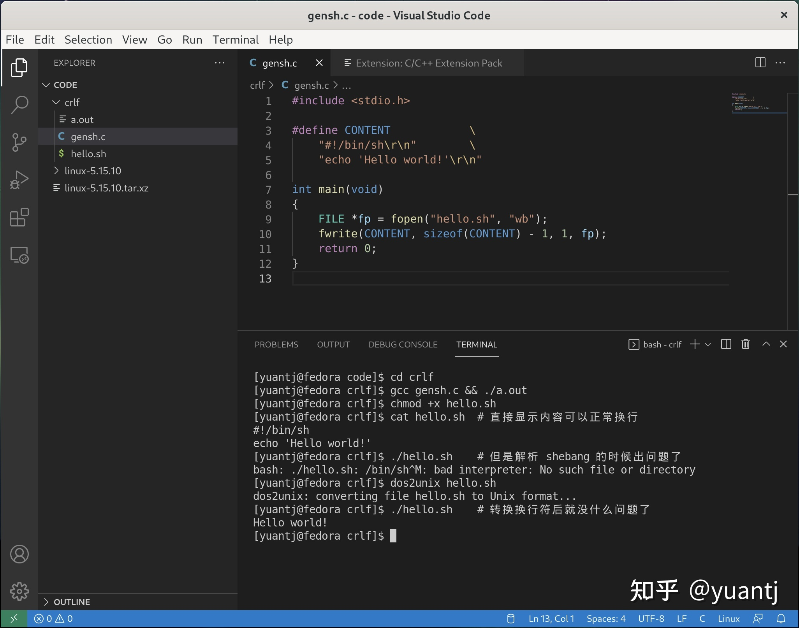
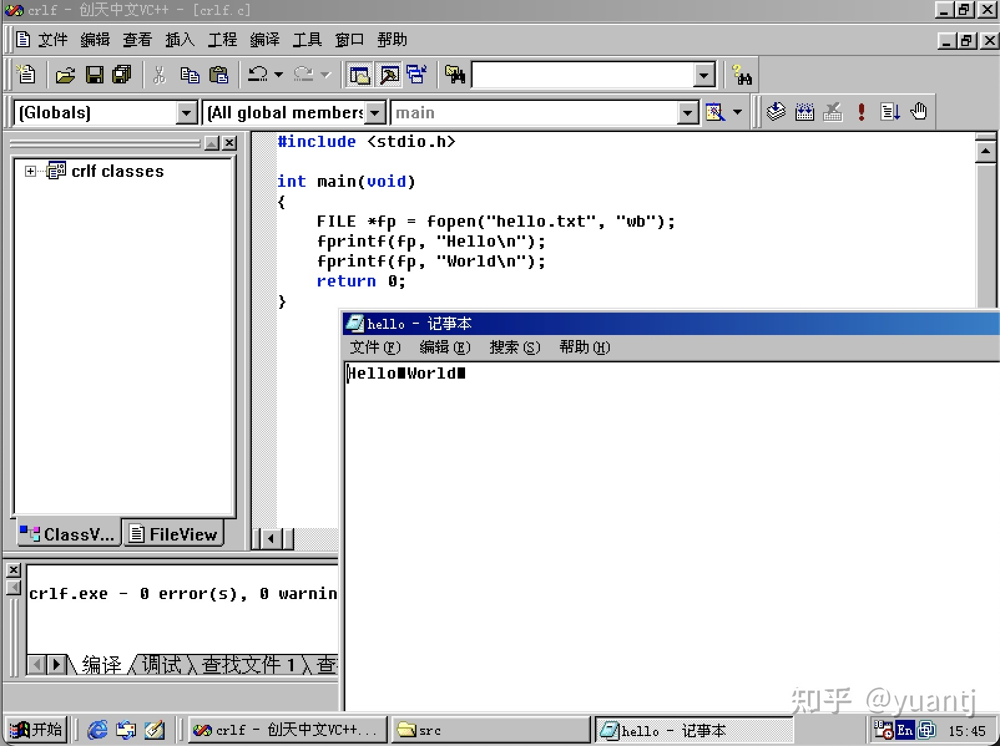
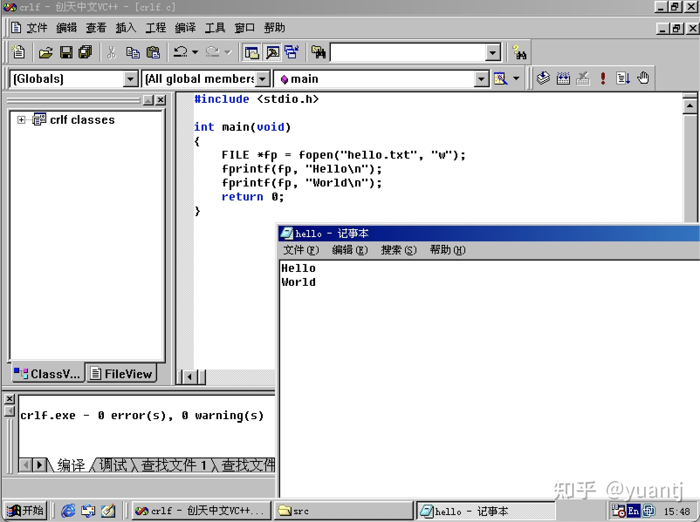

文件在读写之前应该先打开文件，在使用结束之后应该关闭文件。
**文件是一种资源，一个程序能打开的文件是有限的。建议不使用文件时进行文件的关闭。**
C语言打开、关闭、操作 文件的方法列举：
```c
FILE* fopen(const char* filename, const cahr* mode);
- fopen::文件打开失败或打开错误的时候，会返回 NULL
- fopen::r打开没有则报错，a、w打开没有则创建。
- fopen::w打开文件会将文件中所有的内容清空以写入

int fclose(FILE* stream);
- fclose::关闭文件时记得将文件指针置空
```

```c
//文件的顺序读写    
- 字符串输入函数    fgetc       所有输入流
Write a character to a stream or to stdout
int fputc(int c, FILE* stream);

- 字符串输出函数    fputc       所有输出流
Read a character from a stream or stdin
注意：如果读取失败或者读到文件结尾 fgetc 会返回 EOF(-1，End OF File)
int fgetc(FILE* stream);

- 文本行输入函数    fgets       所有输入流
char* fgets(char* string, int n, FILE* stream);
fgets 从流中读取数据并放到string中，参数n表示一次最多读取多少个元素。
注意三点： 1. 如果一行中元素个数小于 n，那么n无效
          2. n表示最多读多少个元素，但是真正读取的元素个数是 n - 1,最后一个空间是\0
          3. 一行未读完，fgets不会到下一行去读
//文件内容为 abcdefg\nhijklmn
fgets(arr, 4, pf);
printf("%s\n", arr);
fgets(arr, 4, pf);
printf("%s\n", arr);
打印输出：
abc
def
n是最大读取位数，但实际读的字符数为 n-1， 一行未读完 fgets 不会到下一行去读。

- 文本行输出函数    fputs       所有输出流
Write a string to a stream.
int fputs(const char* string, FILE* stream);

- 格式化输入函数    fscanf      所有输入流
fscanf 对比与 scanf，都有格式化输入的意思(只不过scanf针对的是stdin)
int scanf(const char* format [,argument]...);
int fscanf(FILE* stream, const char* format [,argument]...);

- 格式化输出函数    fprintf     所有输出流 
fprintf 对比与 printf，都有格式化输出的意思(只不过printf只针对于stdout罢了)
int printf(const char* format [, argument]...);
int fprintf(FILE* stream, const char* format [, argument]...);

- 二进制输入        fread         文件
size_t fread(void* buffer, size_t size, size_t count, FILE* stream);
从流(stream)中读取 count 个 size 大小的元素到 buffer 中。

- 二进制输出        fwrite        文件
Writes data to a stream.
size_t fwrite(const void* buffer, size_t size, size_t count, FILE* stream);
buffer: 指针，指向要被写入的数据地址
size: 要写的数据元素多大，单位：字节
count: 多少个大小为size的元素

fread 和 fwrite 是一组函数，用于二进制的形式进行文件的读写。
返回值 size_t 表示实际 读/写 的 count 数。未读到或读到文件末尾则返回 0。
```

# 关于二进制读写和文本读写的区别
该问题，在知乎上的一个回答非常合适(回答者：知乎yuantj，主页：https://www.zhihu.com/people/yuantj)。
可以说，这是个历史遗留问题。之所以 C 语言要区分“文本文件”和“二进制文件”这两个概念，是因为每个操作系统存储换行符的方式不一样。类 UNIX 系统（包括 Linux、BSD、现代 macOS 等）用 LF "\n" 表示换行，DOS 和 Windows 系统使用 CRLF "\r\n" 表示换行，Classic Mac OS 使用 CR "\r" 表示换行。这个要是错了，在一些程序中，可能会解析成错误的结果

但是我们在编写 C 语言程序的时候，通常只用 "\n" 表示换行。如果在非类 UNIX 系统上直接这么储存，比如在 DOS 或 Windows 系统，可能就不会正确地显示换行。

而我们的 ANSI/ISO C 语言名义上可是源码级跨平台的呀，所以为了读写文本文件时在不同平台上正确地处理换行符，读写非文本文件（如压缩文件、多媒体文件等）时能够获取相同的字节流，于是就有了 fopen 的 "b" 标签。在类 UNIX 系统上，由于源码和系统处理上都用 "\n" 表示换行，所以忽略该标签，而在 Windows 下，自动将所有 "\n" 转化为 "\r\n" 储存，这样就能做到不同平台行为一致了
