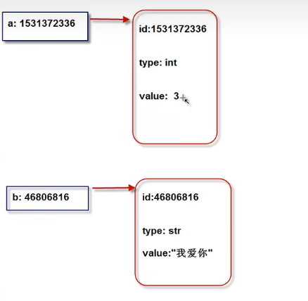

- Python遵循大多数高级语言的基本点
- Python 使用空格表示缩进层次(使用空格代替{}，并且不同空格数表示不同的层次)
- Python使用 `#` 表单行注释 `'''` 表多行注释
- Python是动态类型语言
变量不需要显示声明。根据变量引用的对象，Python解释器自动确定数据类型
- Python是强类型语言
**每个对象都有数据类型，只支持该类型的支持的操作。**

# Python程序的构成
- Python程序由模块组成。一个模块对应一个Python源文件
- 模块由语句组成。运行Python程序时，按照模块中语句的顺序依次执行
- 语句是Python程序的构造单元，用于创建变量、变量赋值、调用函数、控制语句等

# 对象
**对象的本质就是：一个内存块，拥有特定的值，支持特定类型的相关操作**
**Python中一切皆对象。**每个对象由：标识(identity)、类型(type)、值(value)组成
- 标识用于唯一标识对象，通常对应于**对象在计算机内存中的地址**。使用内置函数 id(obj) 可返回对象 obj 的标识。
- 类型用于表示对象存储的数据的类型。类型可以限制对象的取值范围以及可执行的操作，可以使用type(obj) 获得对象的所属类型。
- 值表示对象所存储的数据信息，使用 print(obj) 可以直接打印。
对象在内存中的示意图：

# 引用
Python中，变量也称为：**对象的引用**。因为，**变量存储的就是对象的地址**。
变量通过地址引用了“对象”。
变量位于：栈空间。
对象位于：堆空间。

# 变量的声明与赋值
变量的声明和赋值用于将一个变量绑定到一个对象上。
声明和赋值的格式 `变量名 = 表达式`
在运行过程中，解释器先运行右边的表达式，生成一个代表表达式运行结果的对象。然后将这个对象的地址赋值给左边的变量。
(先梳理右边的对象，有则改变，无责创建，而后将右边对象的地址赋值给左侧变量)

# 变量的删除
`del variable`
如果一个对象没有变量引用，就会被垃圾回收机制进行内存回收。

# 链式赋值
`x = y = 3`

# 系列解包赋值
`a, b, c =4, 5, 6 (a = 4; b = 5; c = 6)`
利用解包赋值可以实现变量值的交换
`a, b = 1, 2; a, b = b, a; print(a, b);  //a = 2, b = 1`

# 常量
**Python不支持常量。**即Python本身的语法规则无法定义出一个常量，我们只能约定常量的命名规则，并在程序的逻辑上不对常量的值作出修改。