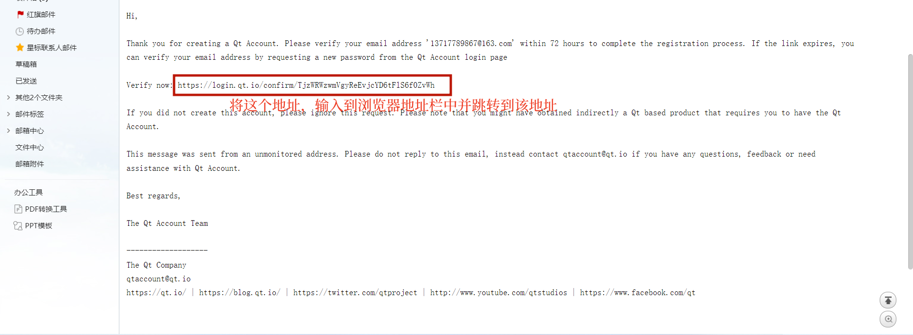

Qt的下载和安装不算复杂。只要安装过一次了解Qt的安装过程，第二次安装时就会显得极为简单。              
1. Qt资源的下载的下载地址: [download.qt.io](download.qt.io "Qt资源地址")。找到 achieve->online_installers，这是你会看到目前所能得到的所有Qt在线下载工具。选择最新版的安装工具进行下载即可         
    - **Qt5.15及之后的版本**，只能使用Qt提供的在线安装方式进行安装。如果想要通过离线的方式安装或受限于网络不能在线安装Qt，要么是安装Qt5.14及之前的版本，要么就只能拷贝Qt库到目标电脑中，纯手工开发。         
    - Qt的早期版本可以到 achieve->qt->version(如5.14)->specific_version(如5.14.2)目录下载所需的安装包。也可以在选择版本类型时勾选 achieve 后选择需要的Qt版本。                   
    - QtDownload网站的资源非常丰富，但是有一些可能整个职业生涯都用不到。所以刚开始的时候能掌握最基本的开发套件就好，以后如果需要这些复杂的内容再了解学习也来得及。              
2. 下载完成后，运行安装程序。登陆即可进行安装。             
    - 如果固态硬盘空间足够建议将Qt安装到固态硬盘。安装之前建议先为Qt建立一个以版本号结尾的文件夹(我的是Dev:\\\\Qt515)          
    - Qt安装时推荐安装Qt的源代码(Source)，以便日后学习或编译。            
        

## Qt下载

## Qt在线安装

## Qt离线安装

## Ubuntu下Qt的安装
在Qt下载中我们提到过，Linux系统下要下载以 .run 结尾的文件。          
     

.run 文件是无法双击执行的(下载下来后Linux会将其视为普通文件，无执行权限)。想要执行该文件，我们还需要些"科技"手段(赋予该文件执行权限)。                
- 在含有 .run 文件的资源管理器上右键选择 "Open in Terminal"                  
- 赋予 .run 文件执行权限(在终端中输入 `chmod 744 ./q` ,然后按下 Tab 键)           
- 在终端中输入 `./q` ,然后按下 Tab 和 Enter 键，运行该执行程序。            
- 执行程序执行后，终端会报错，提示没有依赖的库。这时需要在终端中输入  `sudo apt install --reinstall libxcb-xinerama0`            
- 再次输入 `./q` 后按下 Tab 和 Enter 键。            
    
    

Ubuntu安装Qt不建议更改Qt的安装路径。            

选择要安装的组件后，点击下一步进行安装。             

## Qt的卸载与更新
Qt的卸载、更新/安装模块使用的都是它自带的维护工具 MaintenanceTool。    
MaintenanceTool。在Qt的安装目录(D:\\\\Qt515)中。双击即可运行。
- 卸载可以勾选 仅卸载，也可以卸载所有组件。
- 添加/移除组件和安装类似找到Qt版本后，找到要添加/移除的模块勾选/取消勾选即可。

## 注册Qt账号

