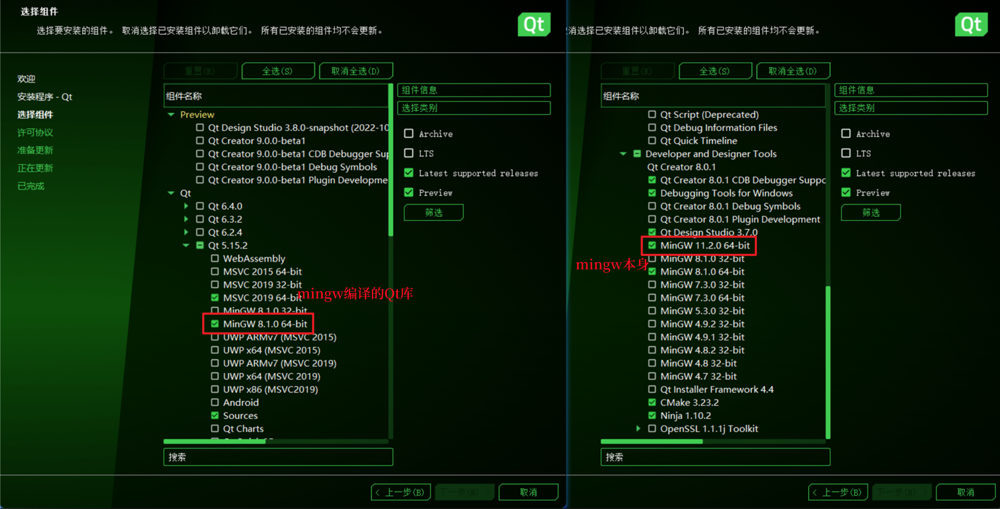
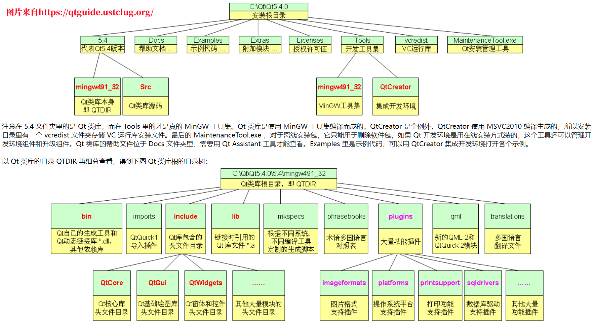
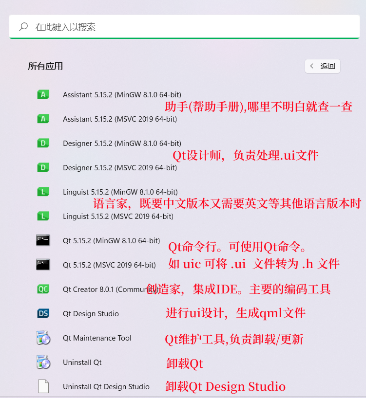
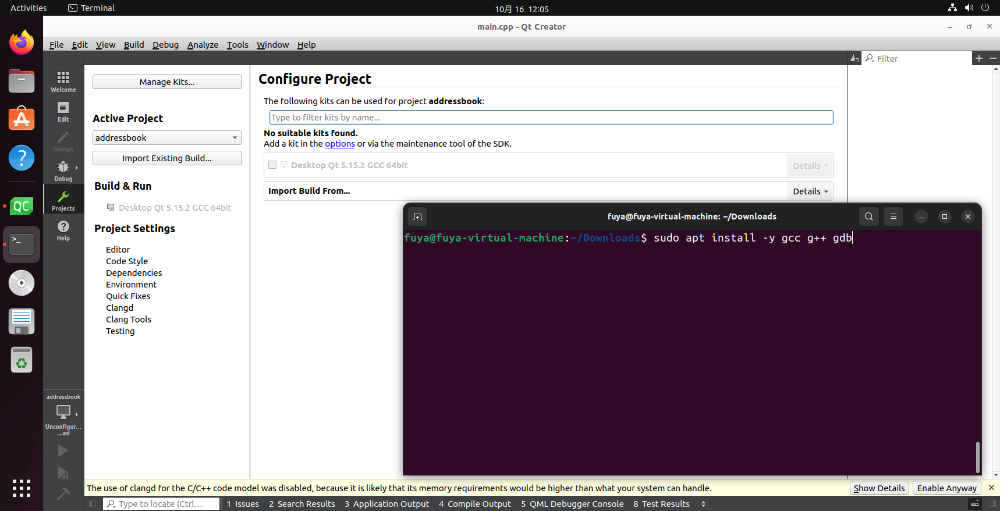

Qt的安装步骤可以跳转到 [Qt的安装](./01Qt%E7%9A%84%E5%AE%89%E8%A3%85.md) 查看。这里咱们主要说的是 Qt 安装之后的Qt的目录结构，以及安装Qt时候都安装了些什么。                   

## 两个mingw的区别
安装Qt时候我们可以在安装页面看到两个 mingw。             
这两个mingw当然是不一样的。上边的 mingw 是Qt库，下方的 mingw 是 mingw 库。         
那既然下方的是 mingw 库，上边的为什么也起名 mingw 呢？这是因为上边的mingw指的是在 MinGW 环境下编译的Qt库。同理上边的 MSVC 指的是在 msvc 环境下编译出的 Qt 库。因此，当你想要**引入Qt库的时候，需要找到上方的 MinGW 或者 MSVC 目录。而需要引入 MinGW 编译器的时候需要引入下方的mingw。         
上边的 MinGW 和 MSVC 安装在 安装目录\/Qt版本\/mingw(msvc)，如果安装 mingw 编译器，则 mingw 编译器会被安装在 安装目录\/Tools\/mingw。          
           

## Qt的安装目录
我们常说安装Qt、安装Qt。Qt是安装了，到底是安装了什么呢。下边的两张图介绍了Qt安装后的目录结构，以及开始菜单里展示的软件。  
       
       

**为什么开始菜单里一个软件出现两次(后面跟着mingw/msvc)**。这是因为Qt是跨平台的，为了适配这些平台 Qt 提供了 mingw 编译库和 msvc 库。不同的编译库对同一操作其处理过程、存放地址以及库函数也存在一定的差异，由此就导致了 Qt 需要编写不同的软件来适配这些差异。至于QtCreator作为IDE，它不涉及这些差异内容，因此它就不需要对开发环境进行区分。
      
## Linux下Qt无法正常编译
1. Linux下Qt项目的编译是需要 gcc 环境的。如果未安装 gcc 那么项目的 Kits 就无法指定。这时只需要安装 gcc 重启 Qt 就好了。
         

2. 安装 Qt 后，提示缺少 "GL/gl.h: No such file or directory"。这是缺少 OpenGL 库导致的。使用 `sudo apt-get install mesa-common-dev` 进行 OpenGL库 的安装。           
关于本问题，更详细的描述可以参考：[https://blog.csdn.net/u010168781/article/details/80896797](https://blog.csdn.net/u010168781/article/details/80896797)        

[gl.h](./assets/install_instruction/036glhnotfound.png)          
