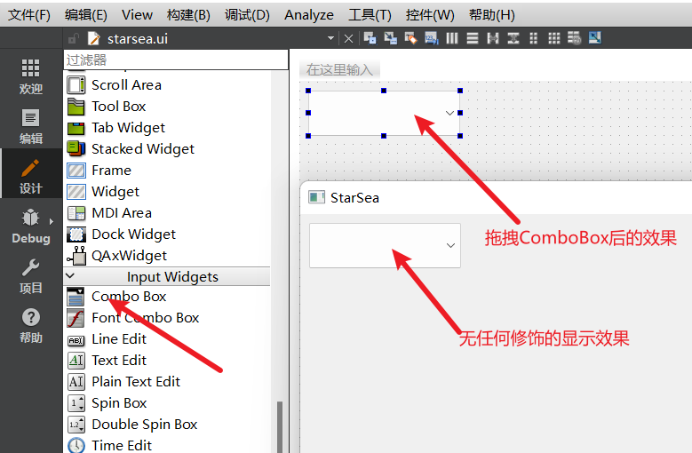

Qt的原生库有很多，像容器、布局、弹簧、按钮等等等等。但绝大多数组件都继承自QWidget，因此组件之间有很多相同的内容。这就给我们只了解一到两个组件就能摸索使用大多数组件提供了前提条件。            
对于一个组件，个人认为没必要做到全知全能。毕竟对于开发人员可能整个开发生涯也接触不到一些冷门的属性和成员，因此了解常用的属性和成员，并能够通过查询帮助文档快速完成编码就可以了。            
Tips：不要排斥帮助手册，也没必要因为自己的编程能力强/差，感觉帮助文档没用或者抱有一种帮助手册很强可我啥也不会的态度来看待帮助文档。对于开发人员开说能够使用帮助文档快速上手一个项目完成Coding，如果有必要再细读说明文档。因为下一个项目还用不用到本项目中的库谁也说不好。        
#### QMainWindow、QDialog、QWidget三种界面模板的区别
QMainWindow 作为独立的主窗口来使用(如多界面跳转时每个页面都是独立的主窗口)                   
QWidget一般作为子窗口嵌套到QMainWindow中使用。      
QDialog 是做对话框时使用。    

## 初始Qt组件
- 双击Qt工程的.ui文件，左侧展示的我们称其为组件。                   
- Qt中的组件更多的可以理解为部件，即构成页面的组成部分。它可以是一个容器包含好几个小部分，也可以只是一个独立的单元，就像是ui设计师中展示的一个个鲜明的组成。             
- 组件是界面的组成部分，因此任何人都可以创建属于自己的组件。甚至于自己写一个完全独立于Qt的组件。                 
- 组件有着三大组成部分：位置、样式以及动作。这三大组成部分分别对应：组件在页面中的位置、组件所对应的类的属性、方法。              
- Qt提供的组件可以分为：布局管理器、分隔器、按钮、视图、列表、容器、带有输入功能的组件 以及 带有输出功能的组件(对应Qt设计师左侧的内容)。          
Qt组件在使用上是极其类似的，因此了解每类(/全部)组件中一到两个的使用然后再探索其他组件的使用，切不可一昧求全。

## 组件的创建
**Qt中一个组件对应一个类**。Qt已经定义好的类被集成到Qt的ui设计师中，可以直接拖拽使用，也可以通过手动构造一个类的方式来创建一个组件。因此Qt创建组件就有了两种方式。                
1. 通过ui设计师界面直接拖拽想要的组件到页面中。          
Qt 会在ui页面对应类的构造函数中通过 `ui->setupUi(this);` 语句自动创建对象指针，并且分配堆空间                    
2. 通过构造类对象的方式手动创建组件。如 `QLabel labe`；          
此时所有的组件都是手动编写代码实现的，与 ui->setupUi(this); 没有任何关系。          
手动创建对象可以采用如下两种方式：          
`1. 使用栈空间  QLabel  label_1("text",this);`          
`2. 使用堆空间 QLabel  label_2 = new QLabel("text",this);`          

如何区分 ui 设计师拖过来的组件，以及手动创建的组件          
ui->组件名->方法();      //ui界面拖放的组件需要使用ui进行标识          
声明的组件名->方法();     //手动创建的组件直接以方法名开头   


## ComboBox的使用
### 认识ComboBox
ComboxBox，下拉列表，可在一个框体内列举多个选项供以选择(Qt中所有的组件类均已Q开头，因此ComboBox对应Qt中的QComboBox类)。        
在无任何修饰的情况下，QComboBox是两部分：左边的文本框以及右侧的下拉箭头。当点击下拉列表时就会显示所有的待选项。         
QComboBox在QtCreator中的位置，以及显示样式如图：     
         

### QComBoBox的创建及两三属性、方法

### 使用qss自定义QComboBox样式

### 自定义QComboBox下拉列表
#### 下拉列表居中
```c++
QStandardItemModel* model =  static_cast<QStandardItemModel*>(box->view()->model());
if(model){
    for(int i = 0; i < model->rowCount(); i ++){
        if(model->item(i))
            model->item(i)->setTextAlignment(Qt::AlignCenter);
    }
}
```
#### 设置下拉列表的宽度和高度
```c++
    
```

## QLineEdit的使用
### 认识QComboBox


### 自定义QComboBox样式

## 细说创建组件的两种方式。