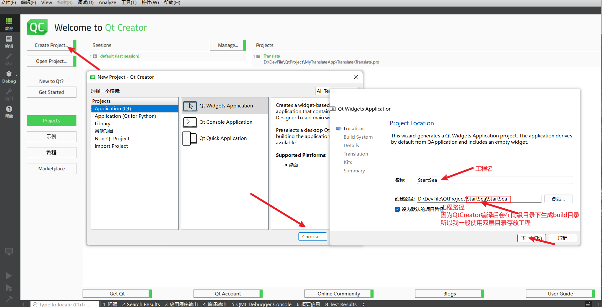
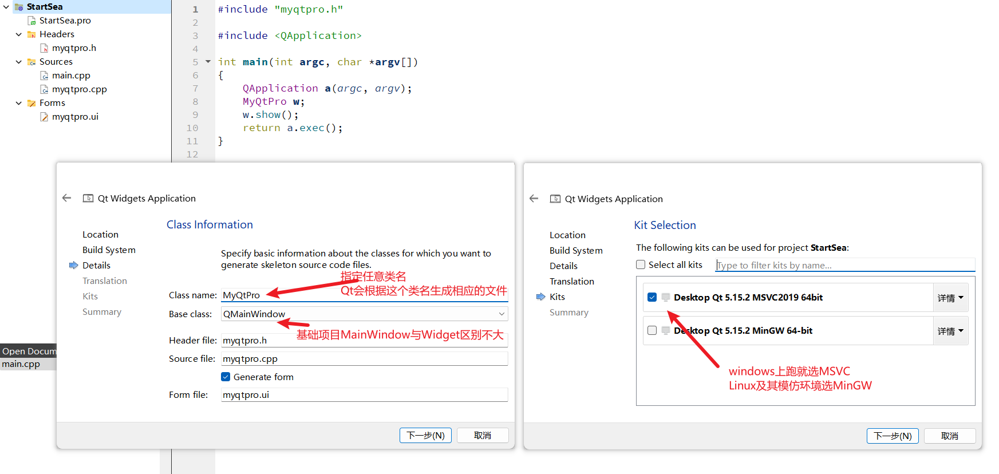
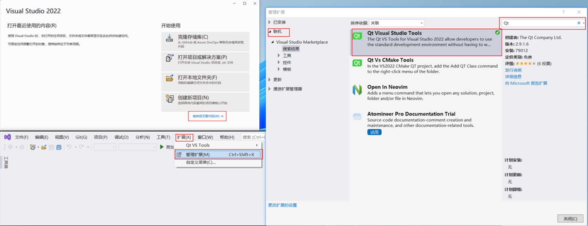
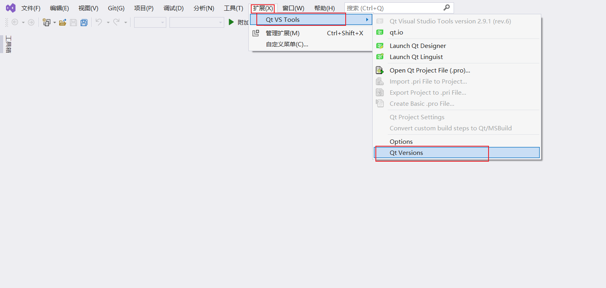
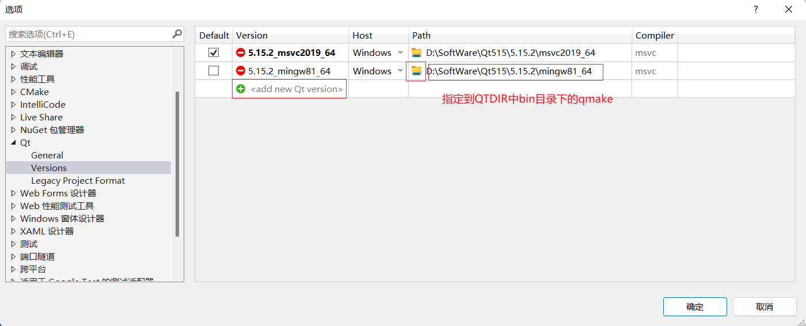
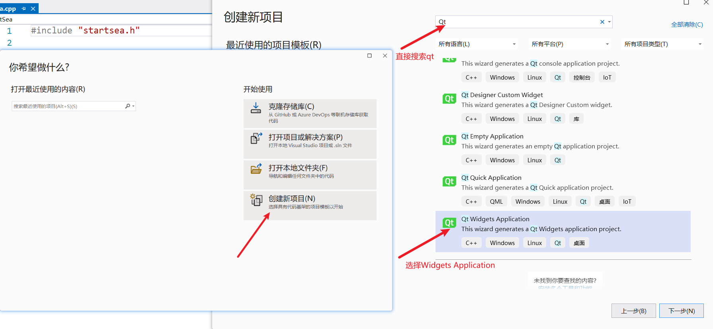
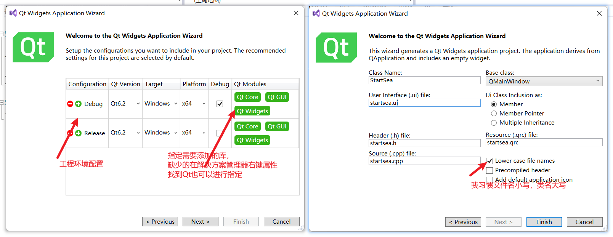
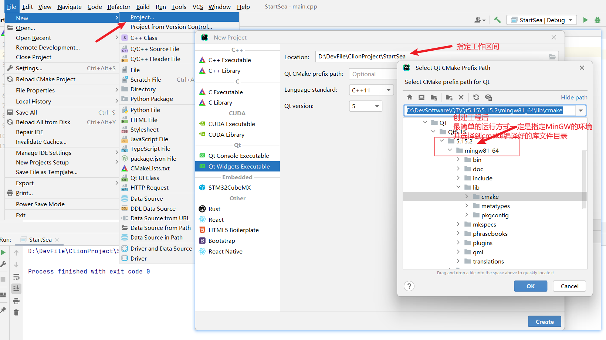
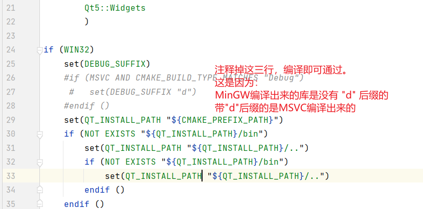

Qt工程的创建方式有很多，最基本的是使用 QtCreator 进行工程的创建。除此之外还可以使用 Visual Studio、VSCode、CLiion 进行 Qt 工程的创建。
- 对于这些开发工具请理性对待。择其一深入学习。一定要能熟练使用一个开发工具。

## 使用QtCreator新建一个Qt工程
使用QtCreator创建Qt是非常简单的只需要完成Qt的安装后点击 Create Project之后一路next就可以创建一个Qt工程。  

示例：        
          
      

## 介绍新建工程的页面

## 介绍Qt为一个新工程做了哪些事

## 使用VS新建一个工程
使用VS创建Qt工程的话,你需要：         
安装VS、Qt并且要安装与VS版本对应的Qt插件--Qt VS Tools(拓展商店搜索Qt)，之后在Qt插件的选项中指定Qt Version。 
VS中安装Qt插件图示：
         
         
         
创建工程示例：  
    
                 

## 使用VScode新建一个Qt工程
使用VScode创建Qt工程的前期准备：    
1. 将Qt目录下的bin目录添加到环境变量中(Qt的安装路径指的是Qt版本下的mingw或者msvc路径)    
2. 安装cmake并确保cmake的bin目录已经在环境变量中
3. 配置MinGW的环境变量(配置gcc推荐的是MinGW，因为相对于其他的类unix编译器MinGW问题较少)           
4. VScode中安装C/C++、CMake、CMake Tools、Qt Configure(新建Qt项目)、Qt tools(与QtCreator联动)插件    
5. 指定Qt Configure设置中MinGW以及Qt的根目录(安装路径)    

使用VSCode创建Qt工程的步骤：       
1. 指定工程存放的路径(使用VSCode打开任意的文件夹,按照以下步骤该文件夹即为工程文件夹)           
2. Ctrl + Shift + P打开命令行      
3. 输入 Qt New Project
4. 若配置成功，会弹出对话框，此时输入工程名。否则检查配置。
5. 之后选择需要的Qt环境，cmake编译还是qmake编译，以及是否创建ui文件。
6. 当完成选项的选择之后就完成了Qt工程的创建。之后需要完成项目的激活工作。
7. Ctrl + Shift + P调查出命令行，输入cmake:get active folder name
8. 选择 gcc 版本，点击运行即可。
使用 VSCode 创建 Qt 工程，可以参考视频：[VSCode创建Qt项目](https://www.bilibili.com/video/BV1TZ4y1t7eq/)

## 使用CLion新建一个Qt工程
虽然CLion支持Qt，但CLion创建的Qt工程有一个特别坑的地方：新建的工程会报错，无法编译运行。     
当前我使用的CLion版本是22.02。 因此建议有了一定的CMake能力再使用CLion进行Qt的编写。     
CLion创建Qt工程示例：       
         
            

关于CLion创建Qt工程，可以参考：
[1.L-Super的CLion创建Qt工程](https://blog.csdn.net/no_say_you_know/article/details/122222426)     
[2.昕某人的使用clion开发QT](https://zhuanlan.zhihu.com/p/461896034)     

## 将QtCreator创建的项目使用VS打开

## 将QtCreator创建的项目使用VSCode打开

## 在VS中通过空项目创建一个Qt工程

## 在MFC程序中使用Qt库

## 写在最后
我个人观点认为，所谓的工具不重要对于初学者来说完全是胡扯。一个只会用QtCreator的初级开发人员，你让他天天用VScode编写代码在刚开始的几个月里那一定是极其糟糕的体验，直接转行都是有可能的。       
虽然工具很重要，但是没必要在工具上投入绝大多数的时间。编程的核心还是编程思维的培养(如何copy、从哪copy、出现bug从哪开始分析，如何修改已出现的bug......)。因此尽快熟悉一两款工具的使用，熟悉一些常用的快捷键，如果感觉某一款工具符合自己的胃口再深入探究，千万不要一次性掌握所有的工具的使用才发现自己的编程只停留在了处理简单的业务逻辑上。          