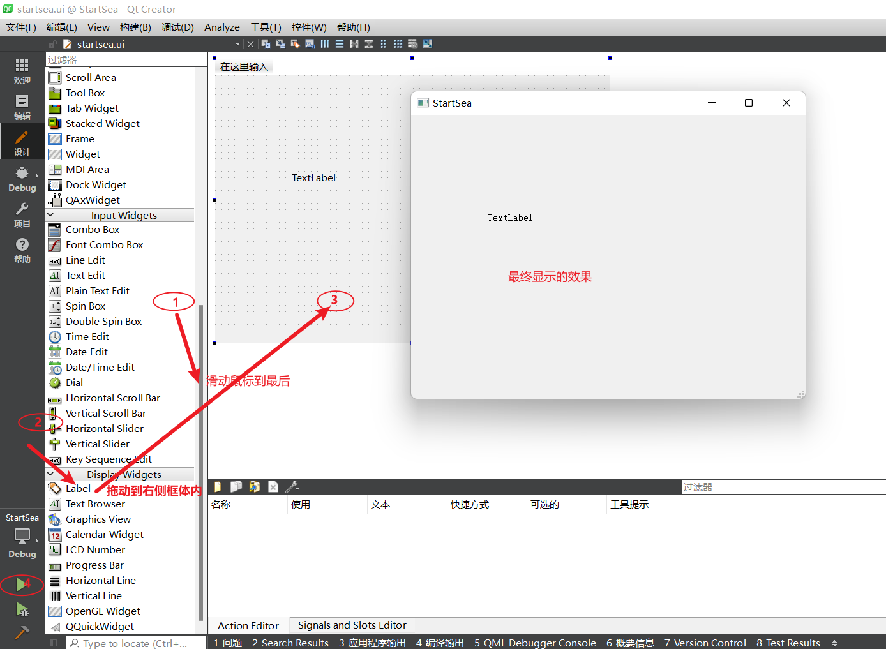
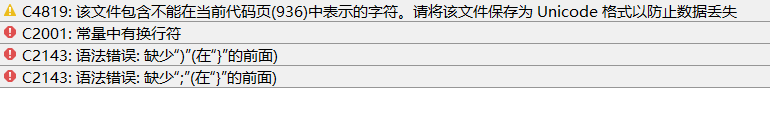
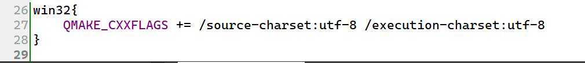

# 1. 展示QLabel效果
       

# 2. 介绍创建Qt组建的两种方式
像 QLabel 这样的可以直接拖到展示框(窗体)内的部件，通常我们将其称之为组件。
Qt中组件的创建有两种方式： 1. 直接拖到窗体内进行展示  2. 通过手动编写代码的方式进行展示。第一种方式通过刚才的介绍基本都熟悉了。下面我们来看第二种方式。
1. 打开文件 startsea.h ，并引入头文件 `#include <QLabel>`
1. 创建一个QLabel类型成员变量
1. 使用QLabel的构造函数初始化之前创建的成员变量 `m_label = new QLabel("这是一个标签", this)`。
Qt的帮助文档很强大，我们可以在Qt帮助中直接搜索 QLabel 查看QLabel类的详细信息。
如果看不懂英文文档，可以到 [http://qt5.digitser.net/5.15/zh-CN/classes.html](http://qt5.digitser.net/5.15/zh-CN/classes.html)， 所有模块类， QWidget 中找 QLabel 的中文手册。
尽管中文手册已经很全面了，但作为程序员还是要懂一些英语的.

## 编译不通过问题
如果你使用的是 MSVC 的开发环境，但是遇到 常量中有换行符，缺少括号之类的提示。
这是因为编码格式不统一而导致的编码问题，在 .pro 文件中加上
```c++
win32{
    QMAKE_CXXFLAGS += /source-charset:utf-8 /execution-charset:utf-8
}
```



## 两种创建方式的比较

# 3. 完善程序

## QLabel介绍

## 为标签设置文本、图片、动画

## 使用QLabel制作信号灯

