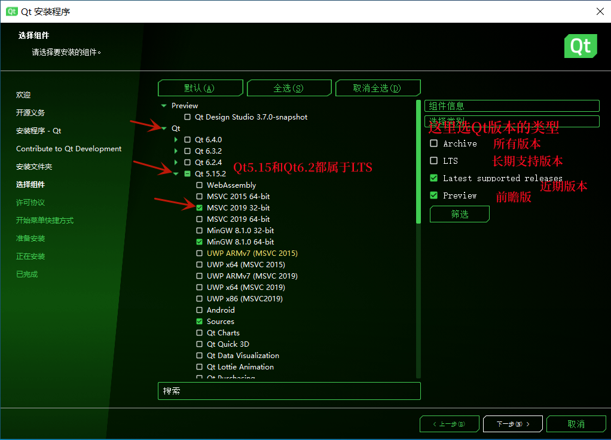
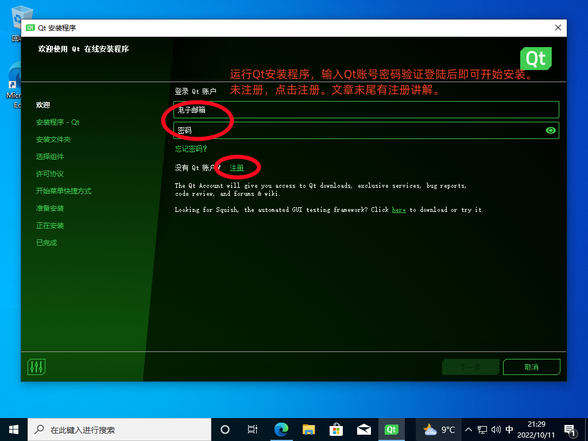
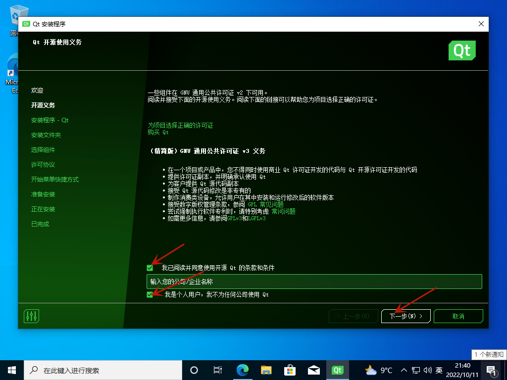
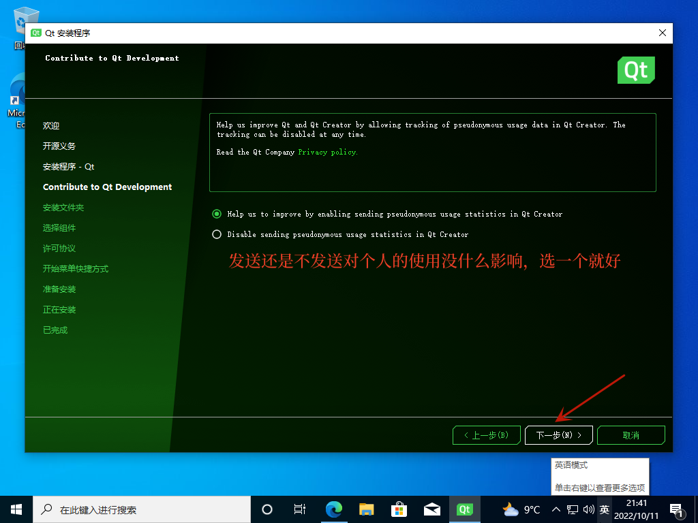
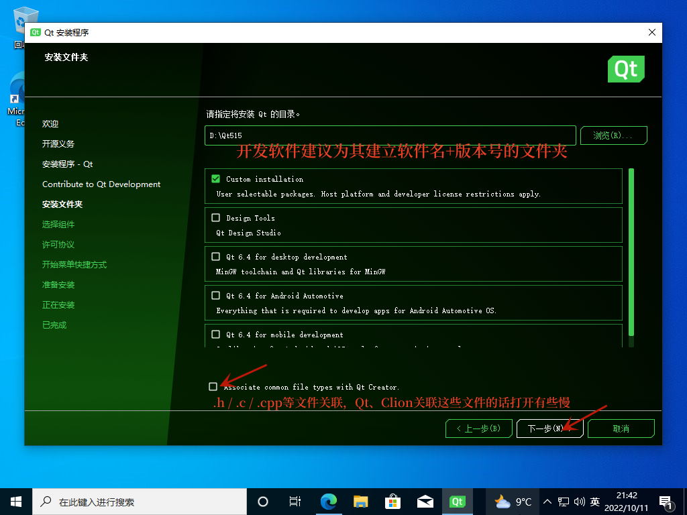
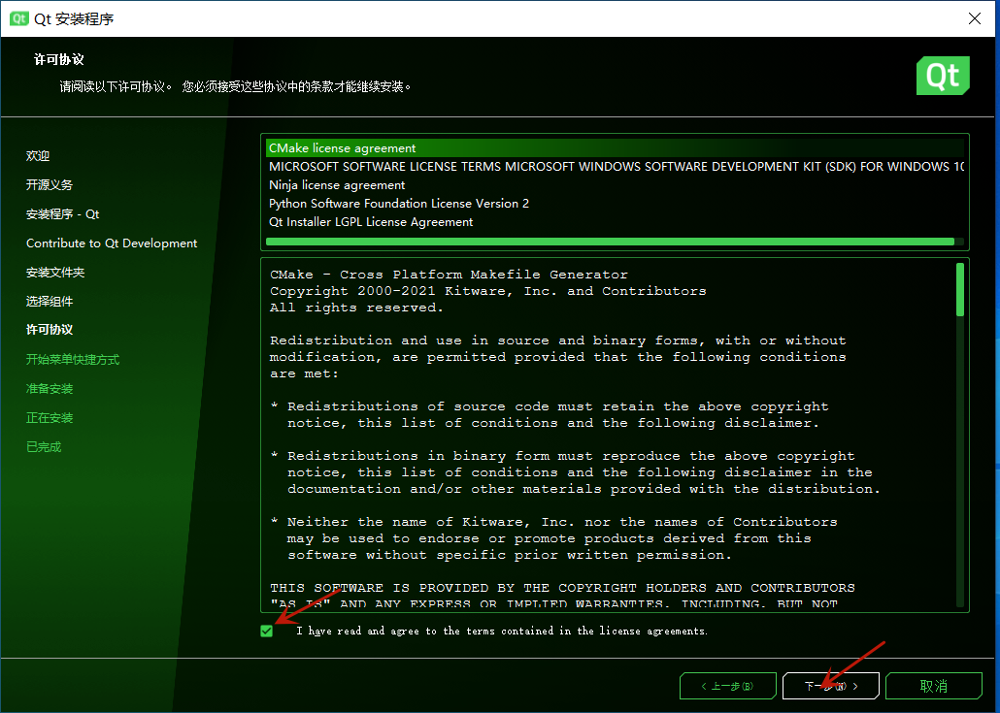

Qt的下载和安装不算复杂。只要安装过一次了解Qt的安装过程，第二次安装时就会显得极为简单。   
1. Qt资源的下载的下载地址: [download.qt.io](download.qt.io "Qt资源地址")。找到 achieve->online_installers，这是你会看到目前所能得到的所有Qt在线下载工具。选择最新版的安装工具进行下载即可
    - **Qt5.15及之后的版本**，只能使用Qt提供的在线安装方式进行安装。如果想要通过离线的方式安装或受限于网络不能在线安装Qt，要么是安装Qt5.14及之前的版本，要么就只能拷贝Qt库到目标电脑中，纯手工开发。
    - Qt的早期版本需要到 achieve->qt->version(如5.14)->specific_version(如5.14.2)目录下载所需的安装包。
    - QtDownload网站的资源非常丰富，但是有一些可能整个职业生涯都用不到。所以刚开始的时候能掌握最基本的开发套件就好，以后如果需要这些复杂的内容再了解学习也来得及。
2. 下载完成后，运行安装程序。登陆即可进行安装。
    - 如果固态硬盘空间足够建议将Qt安装到固态硬盘。安装之前建议先为Qt建立一个以版本号结尾的文件夹(我的是Dev:\\Qt515)
    - Qt安装时推荐安装Qt的源代码(Source)，以便日后学习或编译。
        
        

## Qt下载

## Qt在线安装

## Qt离线安装

## Linux下Qt的安装

## Qt的卸载与更新

## 注册Qt账号

