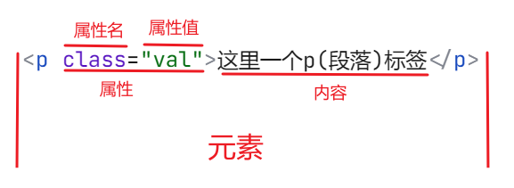

# 认识标签
## 1.标签的结构
[参考MDN中HTML手册，制作如下图片](https://developer.mozilla.org/zh-CN/docs/Learn/Getting_started_with_the_web/HTML_basics)

- 标签之间支持嵌套，如`
<em>这可以写一段话</em>
`
- 标签的属性包含了关于元素的一些额外信息。
- 属性值要使用""进行包含,当标签具有多个属性时，不同属性之间通过空格进行分隔。
- 属性之间无先后顺序

## 2.常见的属性
1. 排版标签
    - 标题标签 h1~h6
    标题标签独占一行，且h1一般用于新闻的标题，网页的logo
    - 段落标签 p
    段落标签独占一行，且段落之间存在间隙。文字一行放不下会自动换行。
    - 换行标签 br
    单标签，让文字强制换行，且不会有明显的距离感。
    - 水平线标签 hr
    单标签，就是一条线。

1. 文本格式化标签<不做记忆>
    - 加粗 b | strong
    b/strong,strong除了加粗，还表示语义上的强调(针对于搜索引擎)
    - 下划线 u | ins
    ins有语义上的强调
    - 倾斜 i | em
    em有语义上的强调
    - 删除线 s | del
    del有语义上的强调
    推荐使用带有语义化的标签

1. 媒体标签
    图片是单标签，视频音频是双标签。
    - 图片标签 img <!-- 图片的大小和来源通过图片标签的属性来设置 -->
    图片标签属性: src(目标路径), alt(替换文本，图片加载失败时显示的文字),
    title标签(提示文本，鼠标移动时提示的文字), width(宽度), height(高度)
    width 和 height 只写一个图片会进行等比例放大/缩小.
    **HTML中没有单位的概念, 只需要写明大小即可**
    **绝对路径的一种写法：网络地址**
    - 音频标签 audio
    `<audio src controls autoplay loop>`
    目前音频支持MP3、Wav、Ogg
    src只指定目录，却没有音频播放的控件。
    controls是音频播放的控件，autoplay是自动播放，loop是循环播放
    **HTML5中如果属性和值是一样的，则可以省略值**，controls、autoplay、loop均可对值进行省略
    - 视频标签 video
    `<video src controls autoplay loop>`
    视频标签目前支持的格式有: MP4、WebM、Ogg
    一般视频较大影响页面加载，通常是引入外部的视频。

1. 链接标签

1. 列表标签

1. 表格标签

# 标签

## 补充一些常用标签

#  注释 \<\!-- --\>
