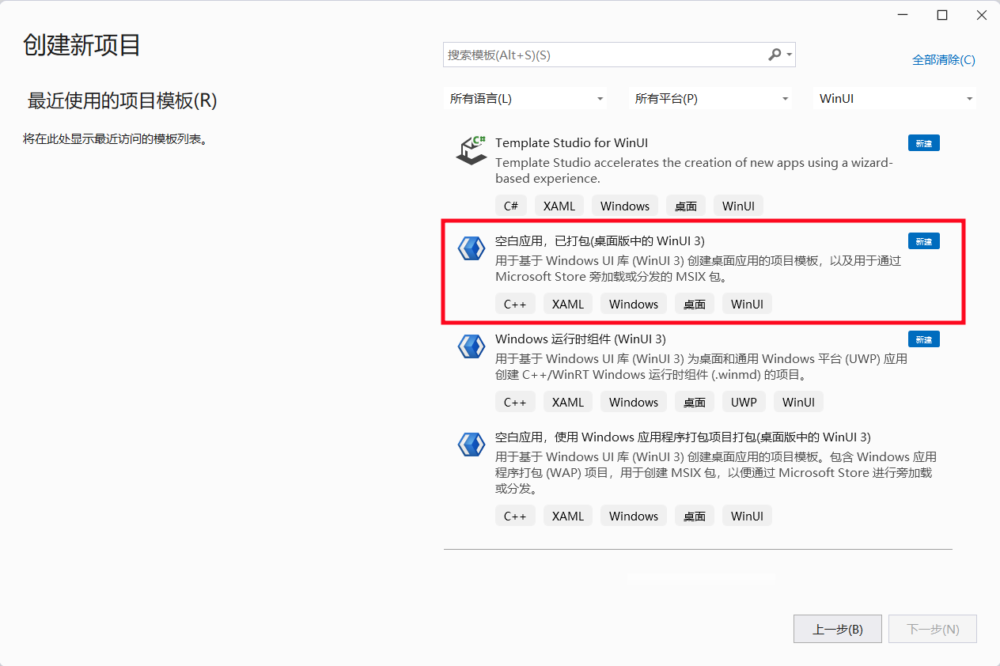
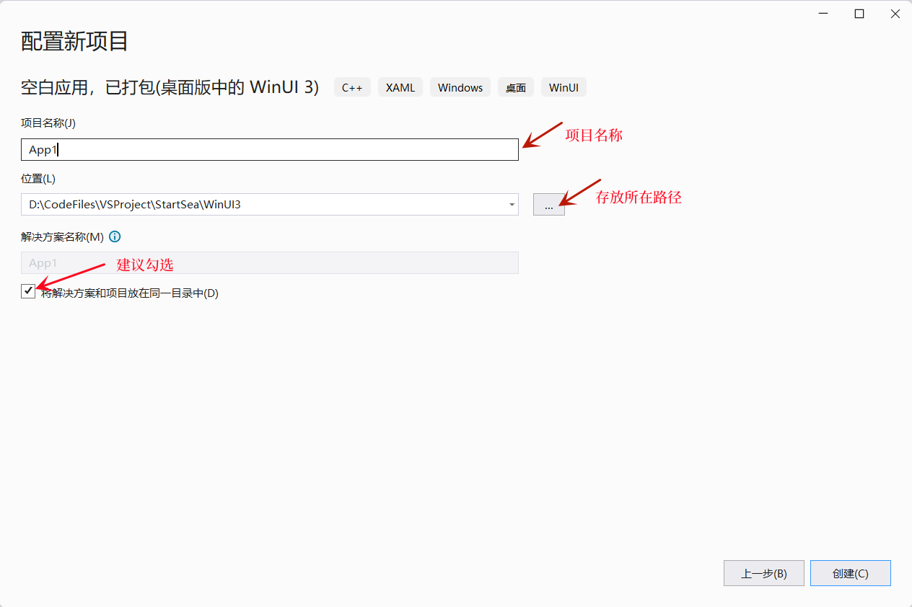
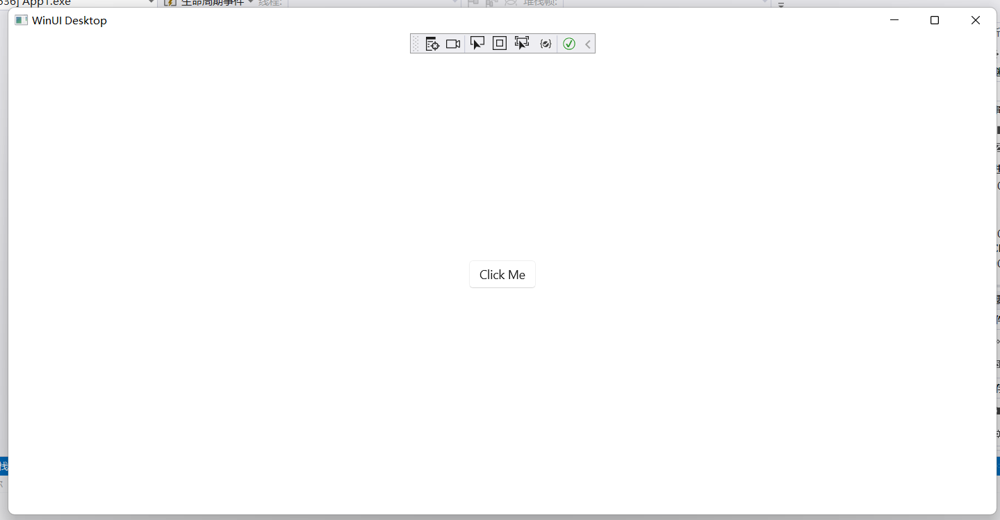

WinUi的Fluent Design设计使得页面看起来更加美观。尽管它(WinUi)只能作用于Windows，但美观的设计依旧值得尝试。    
为使用 WinUi 进行桌面程序开发，你需要：
1. 确保你的电脑使用的是 Windows 系统，并且 Windows 版本号高于 1809(win10_18年_9月更新，OS 内部版本 17763)      
设置->系统->系统信息 查看当前系统版本。
1. 下载并安装 Vistual Studio2019及以上版本         
VS的下载地址：[https://visualstudio.microsoft.com/zh-hans/vs/](https://visualstudio.microsoft.com/zh-hans/vs/)         
1. 下载 WinUi 的 C++ 支持插件： Windows App SDK Cpp Extension    
Windows App SDK Cpp Extension插件的下载地址为: [https://learn.microsoft.com/en-us/windows/apps/windows-app-sdk/downloads](https://learn.microsoft.com/en-us/windows/apps/windows-app-sdk/downloads)       
1. 等待 Windows App SDK Cpp Extension  下载完成后，双击该 .vsix 文件进行安装。         
1. 打开电脑的开发者模式(设置->隐私和安全性->开发者选项->开发人员模式)         

一切准备就绪后。打开VS，并点击创建新项目。        
选中 空白应用，已打包(桌面版中的WinUi3)。            

指定项目名称以及存放路径，完成项目的创建(建议将解决方案放到项目目录下)

待加载完成点击调试，即可查看默认页面。

