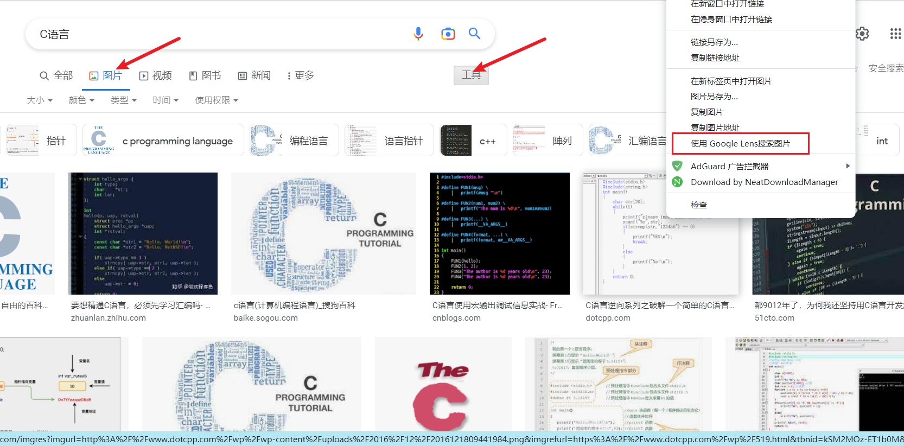

# 实用类搜索技巧
1. **高级搜索**
打开 [https://www.google.com/advanced_search](https://www.google.com/advanced_search) 进行谷歌高级搜索

1. filetype: -- 指定文件类型搜索
`搜索内容 filetype:type` 如 `C语言 filetype:pdf`

1. "", -, *, OR  -- 多关键词搜索运算
"" 匹配关键词的准确搜索。 `"比特币 NFT"`
-  去除关键字。
*  任意匹配搜索。*可代替任意0至无限长的字符。
OR 或者(不加""时的默认选项)

1. 搜图|以图搜索

1. site: -- 站内搜索
`搜索内容 site:域名` 搜索域名网站中的内容(如果没有搜索内容列举，域名可以只写后缀如.com),如 `site:mianshigee.com`

1. intitle: -- 标题搜索
`intitle: 搜索内容` 标题中含有搜索内容，如 `intitle:C语言`
`allintitle 可以匹配多项`

1. translate: -- 翻译
`translate:内容` 翻译搜索内容

1. nearby -- 附近搜索
`搜索内容 nearby` 如 `公园 nearby` 搜索附近的公园。

# 延伸搜索技巧
2. 相关网站搜索
使用 `related:域名` 

2. 网页存档/网页快照
搜索结果后边的下拉三角，可以查看搜索引擎抓取到的上一次的网页内容。

本文内容来自:[YouTube--大方BigFang](https://www.youtube.com/watch?v=WwOBrha5QyI)