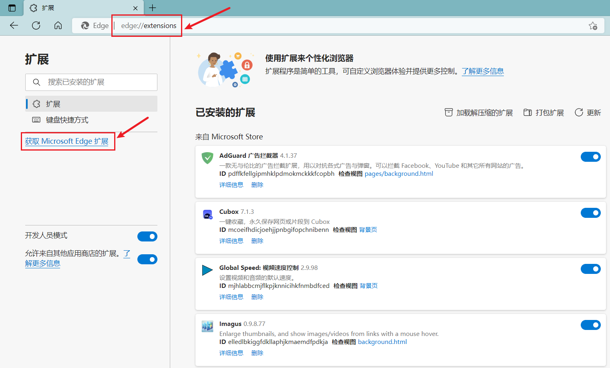

我最常使用的浏览器是 Edge。而 Edge 的强大也值得我们去尝试。

# 1. Edge中常用的插件
## 1.1 强烈推荐的插件
如果采用最小插件安装，那我大概率只安装这几个。
- AdGuard 广告拦截器
超强网页广告拦截器。安装 AdGuard 你会发现浏览器竟如此干净。

- 暴力猴
相比较于油猴，更推荐暴力猴一些，毕竟能省去一步搜索。

## 1.2 实用插件
这一系列的插件是我使用体验还不错的插件。按需安装。
- NeatDownloadManager Extension
不是 IDM 插件，主要是因为我使用的是 NDM 下载器。

- Minimal Scrollbar
让滚动条瘦成一道闪电

- Global Speed: 视频速度控制
控制所有网页的视频播放速度。

- Relingo - Master words from any webpage
按照自己的情况设置英语水平，看英文网页不再困难。
- 沙拉查词-聚合词典划词翻译
划词翻译的良心插件，功能很强大。

- 书签侧边栏
侧边自定义收藏夹。

- Cubox
收藏网站，并支持多端打开。

- OneTab
聚合网页

- Search by Image
以图搜图

- 简悦 - SimpRead
Edge的阅读模式已经很好了，可惜还是没有简悦的强。

## 1.3 Edge安装插件图解
- 点击拓展(设置->拓展)->管理拓展,或者在浏览器的地址栏中输入 `edge://extensions/`
- 在拓展页面搜索你想安装的拓展，点击 '获取' 后点击 '添加拓展'。
   
   
   

# 2. 我收藏的一些网站
## 2.1 各类文件相关的网站
### 2.1.1 文件格式转换
- convertio 使用体验极佳的文件转换网站
[https://convertio.co/zh/](https://convertio.co/zh/)      
- all to all          
[https://www.alltoall.net/](https://www.alltoall.net/)            
- aconvertio
[https://www.aconvert.com/cn/](https://www.aconvert.com/cn/)

### 2.1.2 图片处理
- Bigjpg AI图片放大             
[https://bigjpg.com/zh](https://bigjpg.com/zh)            
- magic eraser 删除图像中不需要的部分            
[https://www.magiceraser.io/](https://www.magiceraser.io/)             
- 在线抠图
[https://www.fococlipping.com/](https://www.fococlipping.com/)            

### 2.1.3 文件传输        
- 奶牛快传 免费大文件传输平台           
[https://cowtransfer.com/](https://cowtransfer.com/)    
- 蓝奏·云网盘 小文件传输的首选            
[https://up.woozooo.com/](https://up.woozooo.com/)    
- Wormhole 创建文件快速分享链接            
[https://wormhole.app/](https://wormhole.app/)          
- File Doge      
[https://filedoge.com/](https://filedoge.com/)   

## 2.2 找资源
- IcoFinder     
[https://www.iconfinder.com/](https://www.iconfinder.com/)  

## 2. 哪怕吃灰也值得收藏
- 全历史           
[https://www.allhistory.com/](https://www.allhistory.com/)    

# 3. Edge的一些常用功能
- Ctrl + J 打开下载