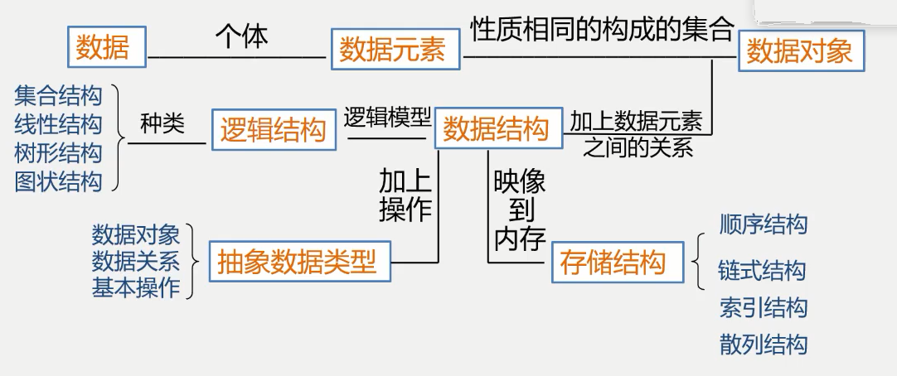

程序 = 数据结构 + 算法，当然这是以前的说法，放到现在仍有很强的指导性。

计算机解决问题的思路：抽象出数学模型；设计算法；编程、调试、运行。对于面向对象更为直观即：抽象出适当的类模型

# 数据(Data)
数据是能输入计算机且能被计算机处理的各种符号的集合
数据是信息的载体，是对客观事物符号化的表示，能被计算机识别、存储和加工(特性)。
按照不同的分类方式可以将数据分为不同的类型。

# 数据元素(Data Element)
数据的基本单位，在计算机通常作为一个整体进行考虑和处理。有时简称为元素、记录、结点。

# 数据项(Data Item)
构成数据元素不可分割的最小单位。

/*# 数据对象(Data Object)
数据对象是性质相同的数据元素的集合，是数据的一个子集。
数据元素与数据对象解析：
数据元素是组成数据的基本单位，而数据对象是性质相同的数据元素的集合。*/

# 数据结构(Data Struct)
**数据元素不是孤立的，他们之间存在某种关系，数据元素相互之间的关系称为结构。**
相互之间存在一种或多种特定关系的数据元素的集合。
通常来说数据结构包含三方面的内容：
1. 数据元素之间的逻辑关系，也称逻辑结构
2. 数据元素及其关系在计算机内存中的表示(又称映像)，称为数据的物理结构或数据的存储结构。
3. 数据的运算和实现，即对数据元素可以施加的操作以及这些操作在相应的存储结构上的实现。
- 逻辑结构与存储结构的关系
存储结构是逻辑关系的映像与元素本身的映像
逻辑结构是数据结构的抽象，存储结构是数据结构的实现。

## 逻辑结构的种类
划分方法：集合、线性结构、非线性结构
- 集合指除了同属于一个集合外无其他任何关系。
- 线性结构如线性表、栈、队列、串
它们的特点是：有且仅有一个开始和一个终端结点，并且所有的结点都最多只有一个直接前趋和一个直接后继
- 非线性结构如树、图
一个结点可能有多个直接前趋和直接后继

## 存储结构的种类
存储结构一般分为四种：顺序结构、链式存储结构、索引存储结构、散列存储结构
散列存储结构：根据结点的关键字计算出该结点的存储地址。


# 数据类型和抽象数据类型
数据类型，无需过多介绍。但有一点一定谨记并理解：
**高级语言中的数据类型明显的或隐含的规定了在程序执行期间变量和表达的所有可能的取值范围，以及在这些数值范围上所允许的操作。**
数据类型的作用：约束变量或常量的取值范围和操作。
数据类型的定义：数据类型是一组性质形同的值的集合以及定义于这个值集合上的一组操作的总称。

## 抽象数据类型(Abstract Data Type，ADT)
抽象数据类型是指一个数学模型以及定义在此数学模型上的一组操作。

## 抽象数据类型的形式定义
抽象数据类型使用**三元组(D, S, P)**表示。
D是数据对象，S是D上的关系集，P是对D的基本操作集。
```C
ADT 抽象数据类型名 {
    数据对象:<数据对象的定义>
    数据关系:<数据关系的定义>
    基本操作:<基本操作的定义>
}
```

# 知识点概括
