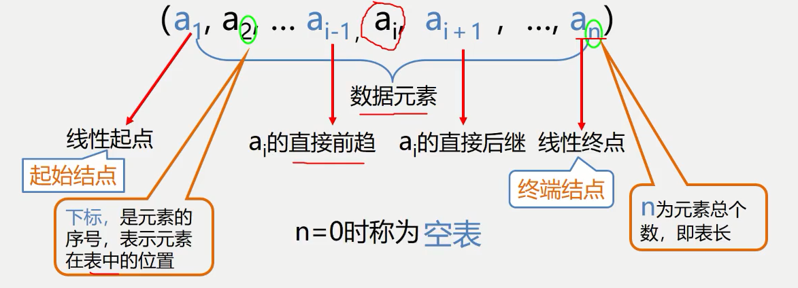

# 线性表
线性表是有相同特性的数据元素的一个有限**序列**。
线性表中一些相关术语如下图：


# 线性表的类型定义
```C
ADT List {
    数据对象: D = {a[i] | a[i]属于Element,(i = 1,2,...,n n>=0) }
    数据关系: R = {<a[i-1], a[i]> | a[i-1], a[i]属于D,(i=2,3,...,n)}
    基本操作: InitList(&L); DestoryList(&L);
    ListInsert(&L, i, e); ListDelete(&L, i, &e);
    ClearList(&L); ListEmpty(L); ListLength(L); GetElem(L, i, &e);
    LocateElem(L, e, compare());
    PriorElem(L, cur_e, &pre_e);求一个元素的前趋元素
    NextElem(L, cur_e, &next_e);
    ListTraverse(&L, visited());遍历
    ...等等
} ADT List
```
# 线性表的顺序存储表示(Sequence List)
线性表的顺序表示又称为顺序存储结构或顺序映像。
顺序存储定义：把逻辑上相邻的数据元素存储在物理上相邻的存储单元中(依次存储，地址连续，中间没有空出存储单元)。
顺序表中，知道某一元素的存储位置，以及相对关系即可计算出任意元素的存储位置。
```C
线性表的顺序存储使用的是：数组
#define LIST_INIT_SIZE 100
typedef struct {
    ElemType elem[LIST_INIT_SIZE];
    int length;
}SqList;
有类型不会分配内存，只有定义了变量以后才会分配空间。
比如这里，在执行 SqList L; 后才会开辟顺序表的内存空间。
```

## 顺序表的优缺点
### 优点
- 存储密度大(结点本身所占存储量/节点结构所占存储量)
- 可以随机存取表中任一元素

### 缺点
- 在插入、删除某一个元素时，需要移动大量元素
- 浪费存储空间
- 属于静态存储形式，数据元素的个数不能自由扩充

## 顺序表的描述代码
```C
//函数结果状态代码
#define True    1
#define FALSE   0
#define OK      1
#define ERROR   0
#define INFEASIBLE  -1
#define OVERFLOW    -2

//InitList（参数用引用）
Status InitList_Sq(SqList &L) {         //构造一天空的顺序表L
    L.elem = new ElemType[MAXSIZE];     //为顺序表分配空间
    if(!L.elem) exit(OVERFLOW);         //存储分配失败
    L>length = 0;                       //空表长度为0
    return OK;
}

//DestroyList
void DestroyList(SqList &L) {
    if(L.elem)
        delete L.elem;  //如果存在释放存储空间
}

//ClearList
void ClearList(SqList &L) {
    memset(L.memory, 0);
    L.length = 0;   //将线性表的长度置为0
}

//GetLength
int GetLength(SqList L) {
    return L.length;
}

//IsEmpty
bool IsEmpty(SqList L) {
    if(L.length == 0) return true;
    else 
        return false;
}

//GetElem
int GetElem(SqList L,int i, ElemType &e) {
    if(i < 1 || i > L.length) return ERROR;
    e = L.elem[i - 1];
    return OK;
}

//locateElem —— 在线性表L中查找值为e的数据元素，返回其序号
int LoacteElem(SqList L, ElemType e) {
    for(i = 0; i < L.length; i++) {
        if(L.elem[i] == e) return i + 1;
    }
    return 0;
}

//ListInsert
顺序表的插入，要考虑插入位置后面的元素。如果插入位置不是最后，要将插入位置后面的元素全部向后移动。注意顺序表中禁止跳元素插入，即插入位置 1 —— n
Status ListInsert_Sq(SqList &L, int i, ElemType e) {
    if(i < 1 || i >= L.length + 1) return ERRPR; //i值不合法
    if(L.length == MAXSIZE) return ERROR;        //当前存储空间已满
    for(j=L.length-1; j >= i - 1; j--)
        L.elem[j + 1] = L.elem[j];
    L.elem[i - 1] = e;
    L.length++;
    return OK;
}

//ListDelete
顺序表中删除的元素不在最后要将后边的元素依次前移
Status ListDelete_Sq(SqList &L, int i) {
    if(i < 1 || i > L.length) return ERROR; //i值不合法
    for(j = i; j <= L.length -1; j++) {
        L.elem[j - 1] = L.elem[j];          //被删除元素之后的元素前移
    }
    L.length--;                             //表长减1
    return OK;
}
```

# 线性表的链式存储表示
- 用一组物理位置任意的存储单元来存放线性表的数据元素
- 这组存储单元既可以是连续的，也可以是不连续的，甚至是零散分布在内存中的任意位置上的
- 链表中元素的逻辑次序和物理次序不一定相同。

## 与链式存储有关的术语
结点：数据元素的存储映像。由数据域和指针域两部分组成。
数据域：存储元素数值数据
指针域：存储直接后继结点的存储位置
链表：n个结点由指针链组成一个链表
单链表：指针域只有指向该结点直接后继的指针，且最后一个结点的直接后继为空
循环链表：指针域只有指向该结点直接后继的指针，但最后一个结点的直接后继是头节点
双链表：指针域的指针既指向直接后继，又指向直接前趋

## 带头结点的单链表
**单链表可以通过表头唯一确定**，因此单链表可以用头指针的名字来命名。
```C
//链表的结构
typedef struct Lnode {
    ElemType data;
    struct Lnode* node;
} Lnode, *LinkList;
```

## 单链表上的操作
```c
//InitLinkList
Status InitLinkList L(LinkList &L){
    L = (LinkList*)malloc(sizeof(LNode));
    L->next = null;
}

//isLinklistEmpty
bool isLinkListEmty(LinkList L) {
    if(L->next) return false;
    return true;
}

//destoryLinklist
//C/C++没有垃圾回收机制,因此销毁列表最好手动删除链表所有结点
Status DestoryList_L(Linklist &L) {
    Linklist* p;
    while(L) {
        p = L;
        L = L->next;
        delete p;
    }
    return OK;
}

//clearLinklist
Status ClearList(Linklist &L) {
    Linklist* p;
    Linklist* q;
    p = L->next;
    while(p) {
        q = p->next;
        delete p;
        p = q;
    }
    L->next = null;
    return OK;
}

//getListLength
int ListLength_L(Linklist L){
    Linklist p = L->next;
    int i = 0;
    while(p){
        i++;
        p = p->next;
    }
    return i;
}
```