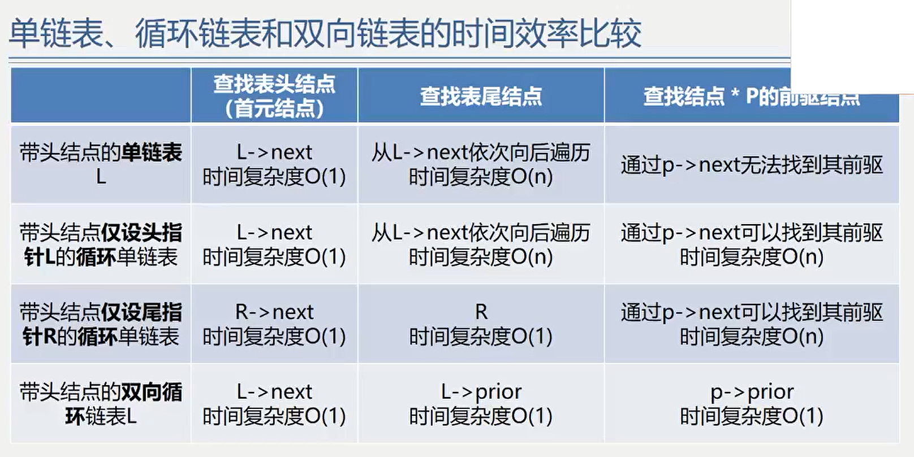
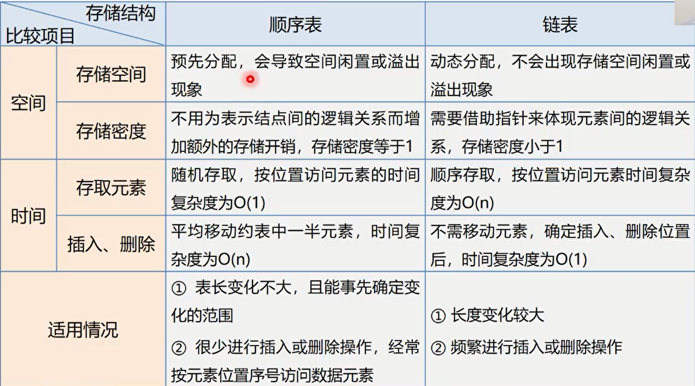
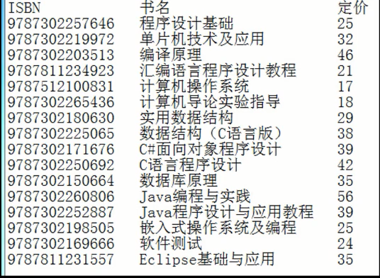

# 线性表
线性表是有相同特性的数据元素的一个有限**序列**。
线性表中一些相关术语如下图：


# 线性表的类型定义
```C
ADT List {
    数据对象: D = {a[i] | a[i]属于Element,(i = 1,2,...,n n>=0) }
    数据关系: R = {<a[i-1], a[i]> | a[i-1], a[i]属于D,(i=2,3,...,n)}
    基本操作: InitList(&L); DestoryList(&L);
    ListInsert(&L, i, e); ListDelete(&L, i, &e);
    ClearList(&L); ListEmpty(L); ListLength(L); GetElem(L, i, &e);
    LocateElem(L, e, compare());
    PriorElem(L, cur_e, &pre_e);求一个元素的前趋元素
    NextElem(L, cur_e, &next_e);
    ListTraverse(&L, visited());遍历
    ...等等
} ADT List
```
# 线性表的顺序存储表示(Sequence List)
线性表的顺序表示又称为顺序存储结构或顺序映像。
顺序存储定义：把逻辑上相邻的数据元素存储在物理上相邻的存储单元中(依次存储，地址连续，中间没有空出存储单元)。
顺序表中，知道某一元素的存储位置，以及相对关系即可计算出任意元素的存储位置。
```C
线性表的顺序存储使用的是：数组
#define LIST_INIT_SIZE 100
typedef struct {
    ElemType elem[LIST_INIT_SIZE];
    int length;
}SqList;
有类型不会分配内存，只有定义了变量以后才会分配空间。
比如这里，在执行 SqList L; 后才会开辟顺序表的内存空间。
```

## 顺序表的优缺点
### 优点
- 存储密度大(结点本身所占存储量/节点结构所占存储量)
- 可以随机存取表中任一元素

### 缺点
- 在插入、删除某一个元素时，需要移动大量元素
- 浪费存储空间
- 属于静态存储形式，数据元素的个数不能自由扩充

## 顺序表的描述代码
```C
//函数结果状态代码
#define True    1
#define FALSE   0
#define OK      1
#define ERROR   0
#define INFEASIBLE  -1
#define OVERFLOW    -2

//InitList（参数用引用）
Status InitList_Sq(SqList &L) {         //构造一天空的顺序表L
    L.elem = new ElemType[MAXSIZE];     //为顺序表分配空间
    if(!L.elem) exit(OVERFLOW);         //存储分配失败
    L>length = 0;                       //空表长度为0
    return OK;
}

//DestroyList
void DestroyList(SqList &L) {
    if(L.elem)
        delete L.elem;  //如果存在释放存储空间
}

//ClearList
void ClearList(SqList &L) {
    memset(L.memory, 0);
    L.length = 0;   //将线性表的长度置为0
}

//GetLength
int GetLength(SqList L) {
    return L.length;
}

//IsEmpty
bool IsEmpty(SqList L) {
    if(L.length == 0) return true;
    else 
        return false;
}

//GetElem
int GetElem(SqList L,int i, ElemType &e) {
    if(i < 1 || i > L.length) return ERROR;
    e = L.elem[i - 1];
    return OK;
}

//locateElem —— 在线性表L中查找值为e的数据元素，返回其序号
int LoacteElem(SqList L, ElemType e) {
    for(i = 0; i < L.length; i++) {
        if(L.elem[i] == e) return i + 1;
    }
    return 0;
}

//ListInsert
顺序表的插入，要考虑插入位置后面的元素。如果插入位置不是最后，要将插入位置后面的元素全部向后移动。注意顺序表中禁止跳元素插入，即插入位置 1 —— n
Status ListInsert_Sq(SqList &L, int i, ElemType e) {
    if(i < 1 || i >= L.length + 1) return ERRPR; //i值不合法
    if(L.length == MAXSIZE) return ERROR;        //当前存储空间已满
    for(j=L.length-1; j >= i - 1; j--)
        L.elem[j + 1] = L.elem[j];
    L.elem[i - 1] = e;
    L.length++;
    return OK;
}

//ListDelete
顺序表中删除的元素不在最后要将后边的元素依次前移
Status ListDelete_Sq(SqList &L, int i) {
    if(i < 1 || i > L.length) return ERROR; //i值不合法
    for(j = i; j <= L.length -1; j++) {
        L.elem[j - 1] = L.elem[j];          //被删除元素之后的元素前移
    }
    L.length--;                             //表长减1
    return OK;
}
```

# 线性表的链式存储表示
- 用一组物理位置任意的存储单元来存放线性表的数据元素
- 这组存储单元既可以是连续的，也可以是不连续的，甚至是零散分布在内存中的任意位置上的
- 链表中元素的逻辑次序和物理次序不一定相同。

## 与链式存储有关的术语
结点：数据元素的存储映像。由数据域和指针域两部分组成。
数据域：存储元素数值数据
指针域：存储直接后继结点的存储位置
链表：n个结点由指针链组成一个链表
单链表：指针域只有指向该结点直接后继的指针，且最后一个结点的直接后继为空
循环链表：指针域只有指向该结点直接后继的指针，但最后一个结点的直接后继是头节点
双链表：指针域的指针既指向直接后继，又指向直接前趋

## 带头结点的单链表
**单链表可以通过表头唯一确定**，因此单链表可以用头指针的名字来命名。
```C
//链表的结构
typedef struct Lnode {
    ElemType data;
    struct Lnode* node;
} Lnode, *LinkList;
```

## 单链表上的操作
```c
//InitLinkList
Status InitLinkList L(LinkList &L){
    L = (LinkList*)malloc(sizeof(LNode));
    L->next = null;
}

//isLinklistEmpty
bool isLinkListEmty(LinkList L) {
    if(L->next) return false;
    return true;
}

//destoryLinklist
//C/C++没有垃圾回收机制,因此销毁列表最好手动删除链表所有结点
Status DestoryList_L(Linklist &L) {
    Linklist* p;
    while(L) {
        p = L;
        L = L->next;
        delete p;
    }
    return OK;
}

//clearLinklist
Status ClearList(Linklist &L) {
    Linklist* p;
    Linklist* q;
    p = L->next;
    while(p) {
        q = p->next;
        delete p;
        p = q;
    }
    L->next = null;
    return OK;
}

//getListLength
int ListLength_L(Linklist L){
    Linklist p = L->next;
    int i = 0;
    while(p){
        i++;
        p = p->next;
    }
    return i;
}

//GetElemValueByIndex
Status GetElem_L(LinkList L, int i, ElemType &e) {
    p = L->next;
    j = 1;
    while(p && j < i) {
        p = p->next;
        j++;
    }
    if(!p || j > i) return ERROR;
    e = p->data;
    return OK;
}

//GetElemIndexByValue
LinkList* LocateElem_L(LinkList L, ElemType e) {
    p = l->next;
    while(p && p->data != e) {
        p = p->next;
    }
    return p;
}
int LocateElem_L(LinkList L, ElemType e) {
    p = L->next;
    j = 1;
    while(p && p->data != e) {
        p = p->next;
        j++;
    }
    if(p) return j;
    return 0;
}

//ListInsert
//插入有头插法和尾插法
Status ListInsert_L(LinkList &L, int i, ElemType e) {
    p = L, j = 0;
    while(p && j < i - 1) {
        p = p->next;
        j++;
    }
    if(!p || j > i - 1) return ERROR;
    s = new LNode;
    s->data = e;
    s->next = p->next;
    p->next = s;
    return OK;
}

//ListDelete
Status ListDelete_L(LinkList &L, int i, ElemType &e) {
    p = L;
    j = 0;
    while(p->next && j < i - 1) {
        p = p->next;
        j++;
    }
    if(!(p->next) || j > i - 1) return ERROR;
    q = p->next;
    p->next = q->next;
    e = q->data;
    delete q;
    return OK;
}

//createListWithNode
void CreateList_H(LinkList &L, int n) {
    L = new LNode;
    L->next = NULL;
    for(i = n; i > 0; i--){
        p = new LNode;
        cin >> p->data;
        p->next = L->next;
        L->next = p;
    }
}
void CreateList_R(LinkList &L, int n) {
    L = new LNode;
    l->next = NULL;
    r = L;
    for(i = 0, i < n; i++) {
        p = new LNode;
        cin >> p->data;
        p->next = NULL;
        r->next = p;
        r = p;
    }
}
```

# 循环链表
循环链表是一种头尾相接的链表。即表中最后一个结点的指针域指向头结点，整个链表形成一个环。
**循环链表的终止条件：判断结点的指针域是否等于头结点。**

## 循环链表的优缺点
### 优点
从表中任一结点出发均可找到表中其他结点。

### 尾指针
通常使用的循环链表是带有尾指针的循环链表。
使用尾指针可使得首元素和尾元素的操作时间复杂度均为O(1)

## 循环链表上的操作
```c
//合并两个循环链表
CycLinkList Conncet(CycLinkList Ta, LinkList Tb) {
    //Ta, Tb都是非空的单循环链表
    p = Ta->next;  //p存表头结点
    Ta->next = Tb->next->next;  //Tb表头连接Ta表尾
    delete Tb->next;  //释放Tb表头结点
    return Tb;  //修改指针
}
```

# 双向链表
在单链表的每个结点里再增加一个指向其直接前驱的指针，这样链表中就有了两个方向不同的链。
双链表的结构表示如下：
```c
typedef struct DuLNode {
    ElemType        data;
    struct DuLNode* prior;
    struct DuLNode* next;
} DuLNode, *DuLinkList;
```
双链表也可以被设计成双向循环链表。

## 双向链表上的操作
```c
//DoubleListInsert
void ListInsert_Du(DuLinkList &L, int i, ElemType e) {
    if(!(p = GetElemPointer_Dul(L, i)))  return ERROR;
    s = new DuLNode;
    s->data = e;
    s->prior = p->prior;
    p->prior->next = s;
    s->next = p;
    p->prior = s;
    return OK;
}

//DuLinkListDelete
void ListDelete_Dul(DuLinkList &L, int i, ElemType &e) {
    if(!(p=GetElemPointer_Dul(L, i)))  return ERROR;
    e = p->data;
    p->prior->next = p->next;
    p->next->prior = p->prior;
    free(p);
    return OK;
}
```

# 链表时间复杂度比较


# 顺序表和链表的比较
## 链式存储结构的优点
- 结点空间可以动态申请和释放
- 数据元素的逻辑次序靠结点的指针来指示，插入和删除不需要移动数据元素

## 链式存储结构的缺点
- 存储密度较之顺序表小
存储密度 = 结点数据本身占用的空间/结点占用的空间总量
一般存储密度越大，存储空间利用率就越高。显然顺序表的存储密度为1，链表的存储密度小于1.
- 非随机(顺序)存取结构，访问固定结点开销大

## 对比图


# 线性表及链表的应用
## 线性表的合并
```c
void union(List &La, List Lb) {
    La_len = ListLength(La);
    Lb_len = ListLength(Lb);
    for(i = 1; i < Lb_len; i++) { 
        GetElem(Lb, i, e);
        if(!LocateElem(La, e)) ListInsert(&La, ++La_len, e);
    }
}
```
## 有序表的合并
有顺序的线性表
```c
//顺序表的合并
void MergeList_Sq(SqList LA, SqList LB, SqList &LC) {
    //指针pa和pb分别指向两个表的第一个元素
    pa = LA.elem;
    pb = LB.elem;
    //新表长度为待合并两表的长度之和
    LC.length = LA.length + LB.length;
    //为合并后的新表分配一个数组空间
    LC.elem = new ElemType[LC.length];
    //指针pc指向新表的第一个元素
    pc = LC.elem;
    //指针pa_last、pb_last指向LA表和LB表的最后一个元素
    pa_last = LA.elem + LA.length - 1;
    pb_last = LB.elem + LB.length - 1;
    //两个表都非空
    while(pa <= pa_last && pb <= pb_last) {
        //依次“摘取”两表中值较小的结点
        if(*pa <= *pb) *pc++ = *pa++;
        else *pc++ = *pb++;
    }
    //将LA、LB中剩余的元素加入到LC
    while(pa <= pa_last) *pc++ = *pa++;
    while(pb <= pb_last) *pc++ = *pb++;
}

//链表的合并
void MergeList_L(LinkList &La, LinkList &Lb, LinkList &Lc) {
    pa = La->next;
    pb = Lb->next;
    pc = Lc = La;
    while(pa && pb) {
        if(pa->data <= pb->data) {
            pc->next = pa;
            pc = pa;
            pa = pa->next;
        }
        else {
            pc->next = pb;
            pc = pb;
            pb = pb->next;
        }

    }
    pc->next = pa ? pa : pb;
    //相当于是将La作为了基序列，因此要删除Lb的头结点。
    delete Lb;
}
```
## 练习题
### 实现两个多项式的加减乘运算
题目：            
Pa(x) = 10 + 5x - 4x<sup>2</sup> + 3x<sup>3</sup> + 2x<sup>4</sup>         
Pb(x) = -3 + 8x + 4x<sup>2</sup> - 5x<sup>4</sup> + 7x<sup>5</sup> - 2x<sup>6</sup>

### 稀疏多项式运算
题目：       
A(x) = 7 + 3x + 9x<sup>8</sup> + 5x<sup>17</sup>
B(x) = 8x + 22x<sup>7</sup> - 9x<sup>8</sup>

### 图书管理系统
完成图书的增删改查操作
