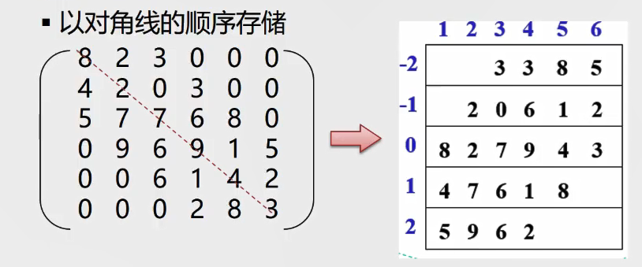
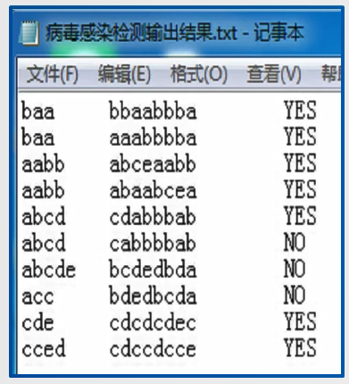

不同于操作受限的线性表，串是内容受限的线性表。串中的每个元素只能是字符。
数组和广义表严格意义上来说是线性结构，非严格意义上来说可以算是线性结构的拓展。

# 串
零个或多个任意字符组成的有限序列
串中元素的逻辑关系与线性表相同，串可以采用与线性表相同的存储结构。

## 子串
一个串中任意个连续的字符组成的子序列(含空串)称为该串的子串。

### 子串位置
子串第一个字符在主串中的位置。

## 区分空串与空格串
- 空串：串长为0
- 空格串：只包含空格的串

## 两串相等
当且仅当两个串的长度相等并且各个对应位置上的字符都相同时，这两个串才是相等的。
**所有的空串是相等的**

## 串的类型定义
```c
ADT String {
    数据对象： D = {ai | ai ∈ CharacterSet, i = 1, 2,...,n, n >= 0}
    数据关系： R1 = {<a(i - 1), ai> | a(i - 1), ai ∈ D, i = 1, 2,...,n}
    基本操作：
        StrAssign(&T, chars)    //串赋值
        StrCompare(S, T)        //串比较
        StrLength(S)            //求串长
        Concat(&T, S1, S2)      //串连结
        SubString(&Sub, S, pos, len)//求子串
        StrCopy(&T, S)          //串拷贝
        StrEmpty(S)             //串判空
        ClearString(&S)         //清空串
        Index(S, T, pos)        //字串的位置
        Replace(&S, t, V)       //串替换
        StrInsert(&S, pos, T)   //子串插入
        StrDelete(&S, pos, len) //子串删除
        DestoryString(&S)       //串销毁
}ADT String
```

## 串的存储结构
串同线性表也分为顺序存储结构(顺序串)和链式存储结构(链串)。
**链串的存储密度低，但是不同于链表的是链串可以在一个结点存储多个字符，形成块，又称块链结构**

### 串的顺序存储
```C
#define MAXLEN 255
typedef struct {
    char ch[MAXLEN + 1];
    int length;
}SString;
```

### 块链结构
```C
#define CHUNKSIZE 80
typedef struct Chunk {
    char ch[CHUNKSIZE];
    struct Chunk *next;
} Chunk;

typedef struct{
    Chunk* head;
    Chunk* tail;
    int curlen;
} LString;
```

## 串的模式匹配算法
确定主串中所包含子串(模式串)第一次出现的位置(定位)
算法应用：搜索引擎、拼写检查、语言翻译、数据压缩
匹配算法的算法种类：BF算法、KMP算法
- BF算法：Brute-Force，又称古典的、经典的、朴素的、穷举的
- KMP算法：特点速度快。

### BF算法
BF算法，简单匹配算法。采用穷举法的思路。
- 将主串的第pos个字符和模式串的第一个字符比较
    - 若相等，逐个比较后续的字符
    - 若不等，从主串的下一个字符起，重新与模式串的第一个字符比较。
    - 直到主串的一个连续子串字符序列与模式串相等。
    返回值为S中与T匹配的子序列第一个字符的序号,即匹配成功
    否则匹配失败，返回0
```C++
int index_BF(SString S, SString T) {
    int i = 1;
    int j = 1;
    while(i <= S.length && j <= T.length) {
        if(s.ch[i] == t.ch[j]){
            i++;    //主串和子串依次匹配下一个字符
            j++;
        } else {
            i = i - j + 2; //为什么是 i - j + 2. (i - (j - 1)) + 1
                           //j从1开始计算，j-1是除去偏移量，+1是将主串向后移动一位
            j = 1;
        }
    }
    if(j >= T.length) return i - T.length;
    return 0;
}

//指定位置开始查找
int index_BF(SString S, SString T, int pos) {
    int i = pos;
    int j = 1;
    while(i <= S.length && j <= T.length) {
        if(s.ch[i] == t.ch[j]){
            i++;    //主串和子串依次匹配下一个字符
            j++;
        } else {
            i = i - j + 2; //为什么是 i - j + 2. (i - (j - 1)) + 1
                           //j从1开始计算，j-1是除去偏移量，+1是将主串向后移动一位
            j = 1;
        }
    }
    if(j >= T.length) return i - T.length;
    return 0;
}
```

### KMP算法
主串不回溯，子串返回到临时数组的

# 数组
数组：按照一定格式排列起来的，具有相同类型的数据元素的集合。
数组可以有多维，随着现代语言的发展，数组也可以是弹性的。

## 数组的声明及基本操作
`数据类型 变量名称[长度];`
```c
InitArray(&A, n, bound1, ..., boundn)   //构造一个数组
DestoryArray(&A)                        //销毁数组A
Value(A, &e, index1, ..., indexn)       //取数组元素的值
Assign(A, &e, ndex1, ..., indexn)       //给数组元素赋值
```

## 数组的顺序存储
数组的特点：结构固定——维数和维界不变
数组的基本操作：初始化、销毁、取元素、修改元素的值。一般不做插入和删除操作。
所以一般数组都是采用顺序存储结构表示。
**数组可以是多维的，但存储数据元素的内存单元是一维的，因此多维数组在内存中的映射就是一维的**
多维数组的存储可以采用行优先，也可以采用列优先的方式。当然大多数语言采用的都是行优先算法。

### 特殊矩阵的压缩存储
一种压缩思路：多个数据元素的值相同，则只分配一个元素的存储空间；零元素不占用存储空间。
- 什么样的矩阵可以压缩存储
一些特殊矩阵，如：对称矩阵，对角矩阵，三角矩阵，稀疏矩阵等。

### 1.对称矩阵
对称矩阵满足 a(ij) = a(ji)
存储方法：只存储上(下)三角以及对角线上的元素。
元素所占用的空间数：n * (n + 1) / 2。
**思路：使用一维数组进行对称矩阵的映射**

### 2.三角矩阵
三角矩阵满足：对角线以上(下)的数据元素(不包括对角线)全部元素为常数C。
存储方法：类似于对称矩阵，但是要多占用一个存储空间用于存储C。
元素所占的空间数： n * (n + 1) / 2 + 1;
和一维数组的对应关系:
上三角矩阵： `k = (i - 1) * (2 * n - i + 2) / 2 + j - i + 1; i < = j`
            `k = n * (n + 1) / 2 + 1; i > j` 
下三角矩阵： `k = i * (i - 1) / 2 + j`
            `k = n * (n + 1) / 2 + 1`

### 3.对角矩阵
特点：非零元集中在对角线为中心的带状区域，区域外的值全为0.
存储方法：斜线式存储，将每条斜线上的元素成一行.
**不同于一维数组的映射，对角矩阵采用的是二维数组的存储方式。压缩比:斜线数/MAX(行,列)**


### 4.稀疏矩阵
特点：零元素占比高。
存储方法：
- 三元组表示法。存储各非零元的值、行列位置和矩阵的行列数
**为更可靠描述，通常再加一个“总体”信息，即总行数、总列数、非零元总个数**
- 十字链表法。使用链表保存， row, cloumn, row, right_ptr, down_ptr;

# 广义表
广义表(又称列表，List)是n个元素 a0,a1,...,an 的有限序列。其中每一个ai或者是原子，或者是一个广义表。

广义表和线性表的区别：广义表中元素类型不一定相同。
广义表通常记作： LS = (a1, a2, ..., an)
其中 LS为表名，n为表的长度，每一个ai为表的元素。
**注意：在广义表中，表头可以是一个原子或子表。但是表尾一定是一个子表。**
`head(LS) = a1.  tail(LS) = (a2, ..., an)`

## 广义表的性质
- 广义表中的数据元素是有相对次序的。一个直接前驱和一个直接后继。
- 广义表的长度定义为最外层所包含的元素的个数。
`C = (a, (b, c))是长度为2的广义表`
- 广义表的深度定义为该广义表展开后所含括号的重数
`A = (b, c)深度为1， B = (A, d)深度为2, C = (f, B, h)深度为3`
**注意：原子的深度为0，空表深度为1**
- 广义表可多层嵌套
由于广义表不仅集中了线性表、数组、树和有向图等常见数据结构的特点，
还可以有效地利用存储空间，因此在计算机的许多应用领域都有成功使用广义表的实例。

## 广义表和线性表的区别
广义表可以看作是线性表的推广，线性表可以看作广义表的特例。
说白了还是那句：**广义表中元素类型不一定相同**

## 广义表的基本运算
广义表通过链表来进行存储。因为广义表元素类型不确定，不满足数组的类型要求。
- GetHead(L)：非空广义表的第一个元素
- GetTail(L)：非空广义表除去表头元素以外其他元素构成的表。**表尾一定是一个表。**


# 练习题
## 病毒感染检测

注意点：病毒的基因序列是环状的。不能用未加任何改造的算法直接比较得出结果。
